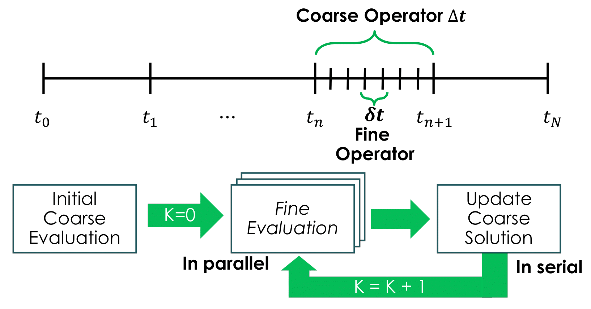

. index::
   pair: RAPID;Home

Welcome to RAPID's documentation!
======================================

This document describes an open source power system simulation toolbox: Resilient Adaptive Parallel sImulator for griD (RAPID), a package of Python codes that implements an advanced power system dynamic simulation framework.  RAPID utilizes and incorporates emerging solution techniques; a novel "parallel-in-time" (Parareal) algorithm, adaptive model reduction, and semi-analytical solution methods. Moreover, the whole simulation process for the transmission network has been coupled with OpenDSS, a widely used open-source distribution system simulator, to enable the co-simulation of integrated transmission and distribution systems. RAPID has a great potential to significantly improve the computational performance of time-domain simulation (i.e., solving a large number of nonlinear power system DAEs) and achieve an ambitious goal of facilitating "faster-than-real-time simulation" for predicting large-scale power system dynamic behaviors.

Installation
------------

-  Download and install python 3.5 version

-  To use MPI, please install mpi4py (https://mpi4py.readthedocs.io/en/stable/install.html) 

-  Install necessary Python packages (numpy, scipy, pandapower, numba).

Citing :math:`RAPID`
--------------------

| Byungkwon Park, Kai Sun, Aleksandar Dimitrovski, Yang Liu, Md Arifin
  Arif, Srikanth Allu, and Srdjan Simunovic, “Performance and Feature
  Improvements in Parareal-based Power System Dynamic Simulation,” *2020
  IEEE International Conference on Power Systems Technology (POWERCON)*,
  Nov. 2020.
| doi:
  `10.1109/POWERCON48463.2020.9230544 <10.1109/POWERCON48463.2020.9230544>`__
| Byungkwon Park, Kai Sun, Aleksandar Dimitrovski, Yang Liu, and Srdjan
  Simunovic, “Examination of Semi-Analytical Solution Methods in the
  Coarse Operator of Parareal Algorithm for Power System Simulation,”
  *IEEE Transactions on Power Systems*, Nov. 2020.
| doi:
  `10.1109/POWERCON48463.2020.9230544 <10.1109/POWERCON48463.2020.9230544>`__

Collaboration
-------------
The development team is composed of researchers from:

* Oak Ridge National Laboratory, Oak Ridge
* University of Tennessee, Knoxville
* University of Central Florida, Orlando 

If you have found :math:`RAPID` to be valuable, please feel free to
contact us for potential collaborations and consider supporting the
project. Any supports and contributions from the community allow us to
improve the features of this open-source tool and investigate emerging
techniques.

Data
====
Two test networks, New England and Polish, are available as a small and large test network, respectively. Each test network data contains the dynamic data and
network data.

Dynamic Data
------------

The dynamic data contains generator data (GenData), excitation data
(ExcData), turbine governor data (TurbData), and generator saturation
data (satData).

-  | GenData: Each column in data corresponds to the following
     parameters
   | Gen. Bus :math:`X_d` :math:`X_{d}^{'}` :math:`X_{d}^{''}`
     :math:`T_{do}^{'}` :math:`T_{do}^{''}` :math:`X_{q}`
     :math:`X_{q}^{'}` :math:`X_{q}^{''}` :math:`T_{qo}^{'}`
     :math:`T_{qo}^{''}` H D :math:`R_a` :math:`X_{l}` :math:`T_{c}`
     :math:`f_{B}` MVA

   | Gen. Bus: bus number at which that generator is located
   | :math:`X_d`: d-axis unsaturated synchronous reactance
   | :math:`X_{d}^{'}`: d-axis unsaturated transient reactance
   | :math:`X_{d}^{''}`: d-axis unsaturated subtransient reactance
   | :math:`T_{do}^{'}`: d-axis transient open circuit time constant
   | :math:`T_{do}^{''}`: d-axis subtransient open circuit time constant
   | :math:`X_{q}`: q-axis unsaturated transient reactance
   | :math:`X_{q}^{'}`: q-axis unsaturated transient reactance
   | :math:`X_{q}^{''}`: q-axis unsaturated subtransient reactance
   | :math:`T_{qo}^{'}`: q-axis transient open circuit time constant
   | :math:`T_{qo}^{''}`: q-axis subtransient open circuit time constant
   | H: generator inertia
   | D: generator damping constant
   | :math:`R_a`: stator resistance per phase
   | :math:`X_{l}`: stator leakage reactance per phase
   | :math:`T_{c}`: the open circuit time constant of the dummy coil,
     usually set to 0.01 s
   | :math:`f_{B}`: nominal frequency of the rotor of the generator (Hz)
   | MVA: generator MVA

-  | ExcData
   | :math:`K_A` :math:`T_A` :math:`K_E` :math:`T_E` :math:`K_F`
     :math:`T_F` :math:`A_E` :math:`B_E` VRmax VRmin :math:`T_R`

   | :math:`K_A`: voltage regulator gain
   | :math:`T_A`: voltage regulator time constant
   | :math:`K_E`: exciter constant related to self-excited field
   | :math:`T_E`: exciter time constant, integration rate associated
     with exciter control
   | :math:`K_F`: excitation control system stabilizer gains
   | :math:`T_F`: excitation control system stabilizer time constant
   | :math:`A_E`: IEEE Type-1 exciter saturation function related
     constant
   | :math:`B_E`: IEEE Type-1 exciter saturation function related
     constant
   | VRmax: maximum voltage regulator outputs
   | VRmin: minimum voltage regulator outputs
   | :math:`T_R`: filter time constant

-  | TurbData
   | :math:`T_{CH}` :math:`R_D` :math:`T_{SV}` Psvmax Psvmin

   | :math:`T_{CH}`: Turbine time constant
   | :math:`R_D`: Droop constant
   | :math:`T_{SV}`: Governor time constant
   | Psvmax: Maximum governor set point
   | Psvmin: Minimum governor set point

-  | satData
   | Gen. Bus siTd siaT1 siaTu1 siaT2 siaTu2 siTq siaT1 siaTu1 siaT2
     siaTu2

   | Gen. Bus: bus number at which that generator is located
   | siTd, siaT1, siaTu1, siaT2, siaTu2: d-axis saturation data
   | siTq, siaT1, siaTu1, siaT2, siaTu2: q-axis saturation data

Network Data
------------

The network data contains the network information (mpc) which follows
the format of MATPOWER :cite:`\Zimmerman2011`, which is used
to construct the admittance matrix (:math:`Y_{bus`) and solve the power
flow problem. The system structure is specified by two tables, **bus**
and **branch**.

-  | Bus (mpc.bus)
   | Bus Type :math:`P_d` :math:`Q_d` :math:`G_s` :math:`B_s` Area
     :math:`V_m` :math:`V_a` BaseKV Zone Vmax Vmin

   | Bus: Bus number
   | Type: Bus type (1 = PQ, 2 = PV, 3 = ref, 4 = isolated)
   | :math:`P_d`: d-axis unsaturated transient reactance
   | :math:`Q_d`: real power demand (MW)
   | :math:`G_s`: shunt conductance (MW demanded at V = 1.0 p.u.)
   | :math:`B_s`: shunt susceptance (MVAr injected at V = 1.0 p.u.)
   | Area: area number
   | :math:`V_m`: voltage magnitude (p.u.)
   | :math:`V_a`: voltage angle (degrees)
   | BaseKV: base voltage (kV)
   | Zone: loss zone (positive integer)
   | Vmax: maximum voltage magnitude (p.u.)
   | Vmin: minimum voltage magnitude (p.u.)

-  | Branch (mpc.branch)
   | :math:`F_{BUS}` :math:`T_{BUS}` :math:`BR_R` :math:`BR_X`
     :math:`BR_B` Rate\ :math:`_A` Rate\ :math:`_B` Rate\ :math:`_C` TAP
     SHIFT BR\ :math:`_{STATUS}` ANGMIN ANGMAX

   | :math:`F_{BUS}`: “from” bus number
   | :math:`T_{BUS}`: “to” bus number
   | :math:`BR_R`: resistance (p.u.)
   | :math:`BR_X`: reactance (p.u.)
   | :math:`BR_B`: total line charging susceptance (p.u.)
   | Rate\ :math:`_A`: MVA rating A (long term rating)
   | Rate\ :math:`_B`: MVA rating B (short term rating)
   | Rate\ :math:`_C`: MVA rating C (emergency rating)
   | TAP: transformer off nominal turns ratio, if non-zero (taps at
     “from” bus, impedance at “to” bus, i.e. if :math:`r = x = b = 0`,
     tap = :math:`\frac{|V_f|}{|V_t|}`; tap = 0 used to indicate
     transmission line rather than transformer, i.e. mathematically
     equivalent to transformer with tap = 1)
   | SHIFT: transformer phase shift angle (degrees), positive
     :math:`\Rightarrow` delay
   | BR\ :math:`_{STATUS}`: initial branch status, 1 = in-service, 0 =
     out-of-service
   | ANGMIN: minimum angle difference, :math:`\theta_f - \theta_t`
     (degrees)
   | ANGMAX: maximum angle difference, :math:`\theta_f - \theta_t`
     (degrees)

-  | Generator (mpc.gen)
   | :math:`GEN_{BUS}` :math:`P_G` :math:`Q_G` Qmax Qmin :math:`V_G`
     MBASE GEN\ :math:`_{STATUS}` Pmax Pmin PC1 PC2 QC1MIN QC1MAX QC2MIN
     QC2MAX RAMP\ :math:`_{AGC}` RAMP\ :math:`_{10}` RAMP\ :math:`_{30}`
     RAMP\ :math:`_{Q}` APF

   | :math:`GEN_{BUS}`: bus number
   | :math:`P_G`: real power output (MW)
   | :math:`Q_G`: reactive power output (MVAr)
   | Qmax: maximum reactive power output (MVAr)
   | Qmin: minimum reactive power output (MVAr)
   | :math:`V_G`: voltage magnitude setpoint (p.u.)
   | MBASE: total MVA base of machine, defaults to baseMVA
   | GEN\ :math:`_{STATUS}`: machine status: :math:`>0` = machine
     in-service, :math:`\leq0` = machine out-of-service
   | Pmax: maximum real power output (MW)
   | Pmin: minimum real power output (MW)
   | PC1: lower real power output of PQ capability curve (MW)
   | PC2: upper real power output of PQ capability curve (MW)
   | QC1MIN: minimum reactive power output at PC1 (MVAr)
   | QC1MAX: maximum reactive power output at PC1 (MVAr)
   | QC2MIN: minimum reactive power output at PC2 (MVAr)
   | QC2MAX: maximum reactive power output at PC2 (MVAr)
   | RAMP\ :math:`_{AGC}`: ramp rate for load following/AGC (MW/min)
   | RAMP\ :math:`_{10}`: ramp rate for 10 minute reserves (MW)
   | RAMP\ :math:`_{30}`: ramp rate for 30 minute reserves (MW)
   | RAMP\ :math:`_{Q}`: ramp rate for reactive power (2 sec timescale)
     (MVAr/min)
   | APF: area participation factor

.. raw:: latex

   \newpage

Modeling
========

:math:`NAME` employs the standard dynamic models used for power system
transient and dynamic simulations. The dummy coil model
:cite:`Padiyar2002` is described first, and then the 6th
order generator model. The analysis of transient stability of power
systems involves the computation of the nonlinear dynamic response to
disturbances (typically a transmission network fault) followed by the
isolation of the faulted element by protective relaying. The resulting
formulation consists of a large number of ordinary differential and
algebraic equations (DAEs), which may be represented as:

.. math::

   \begin{aligned}
   \dot{\pmb{x}}= \pmb{f(x,V)} \\
   \pmb{I} = \pmb{g(x,V)}\end{aligned}

where :math:`\pmb{x}` is the state vector of the system;
:math:`\pmb{I}` is the current injection vector in the network frame;
:math:`\pmb{V}` is the bus voltage vector in the network frame;
:math:`\pmb{f}` and :math:`\pmb{g}` represent differential and algebraic
equation vector, respectively.

The differential equations include the synchronous generators (2.2
model) :cite:`Dandeno2003`, and the associated control
systems (e.g., excitation and prime mover governors). The algebraic
equations include the stator algebraic equations (including axes
transformation) and the network equations.

Differential Equations
----------------------

This section illustrates IEEE Model 2.2 with two damper windings on the
q-axis and one damper winding on the d-axis along with the field winding
for the synchronous generators, IEEE Type 1 excitation system, and first
order turbine-governor models. Saturation is represented using standard
saturation factors approach :cite:`KundurBaluLauby1994`. The
dummy coil approach :cite:`Padiyar2002` is used to interface
the generator to the network as a current source. Loads are modelled as
aggregate static loads employing polynomial representation (ZIP load).
The complete model has 15 state variables for each generator including
all the controls.

Synchronous Generator Model 2.2
~~~~~~~~~~~~~~~~~~~~~~~~~~~~~~~

.. math::

   \begin{aligned}
   \dot{\delta} & = \omega_B \omega  \\ 
   \dot{\omega} & = \frac{1}{2H}( T_m - T_e - D \omega ) \\ 
   \dot{\psi_{f}} & = -\frac{\omega_B R_f}{X_{fl}} \psi_f + \frac{\omega_B R_f}{X_{fl}} \psi_{ad} + \frac{\omega_B R_f}{X_{ad}} E_{fd} \\
   \dot{\psi}_{h} & = -\frac{\omega_B R_h}{X_{hl}} \psi_h + \frac{\omega_B R_h}{X_{hl}} \psi_{ad}  \\
   \dot{\psi}_{g} & = -\frac{\omega_B R_g}{X_{fl}} \psi_g + \frac{\omega_B R_g}{X_{gl}} \psi_{aq}  \\
   \dot{\psi}_{k} & = -\frac{\omega_B R_k}{X_{fl}} \psi_k + \frac{\omega_B R_k}{X_{kl}} \psi_{aq}  \\
   \dot{E}^{\text{dum}} & = \frac{1}{T^{\text{dum}}}\Big(-E^{\text{dum}} - (X_{qs}^{''} - X_{ds}^{''})i_q  \Big)  \\ 
   \dot{X}_{ad}^{''} & = \frac{1}{T_{d}} (-X_{ad}^{''} + F_d) \\ 
   \dot{X}_{aq}^{''} & = \frac{1}{T_{q}} (-X_{aq}^{''} + F_q)  \end{aligned}

where :math:`\delta` is the rotor angle; :math:`\omega` is the slip
speed; :math:`\psi_f, \psi_h` are the d-axis flux linkages;
:math:`\psi_g, \psi_k` are the q-axis flux linkages;
:math:`E^{\text{dum}}` is a dummy coil state variable for transient
saliency inclusion; :math:`X_{ad}^{''}, X_{aq}^{''}` are dummy states of
machine reactances representing the fast acting differential equations
to avoid nonlinear algebraic equations of generator source currents,
which are functions of machine reactances
:math:`X_{ad}^{''}, X_{aq}^{''}`.

Turbine Governor
~~~~~~~~~~~~~~~~

.. math::

   \begin{aligned}
   \dot{T}_{m} & = \frac{1}{T_{ch}} (-T_{m} + P_{sv} )  \\ 
   \dot{P}_{sv} & = \frac{1}{T_{sv}} (-P_{sv} + P_c - \frac{1}{R_d}\omega ) 
   \end{aligned}

where :math:`T_m` represents the mechanical torque; :math:`P_{sv}`
represents the turbine valve opening; :math:`P_c` is the power command.

IEEE Type-1 Excitation
~~~~~~~~~~~~~~~~~~~~~~

.. math::

   \begin{aligned}
   \dot{E}_{fd} & = \frac{1}{T_{E}} (-[K_E + A_E(e^{B_EE_{fd}})]E_{fd} + V_R)  \\ 
   \dot{V}_{2} & = \frac{1}{T_{F}} (-V_{2} + \frac{K_F}{T_F}E_{fd} ) \\
   \dot{V}_{1} & = \frac{1}{T_{R}} (-V_{1} + V_T ) \\
   \dot{V}_{R} & = \begin{cases}
   \text{set} \quad V_R = V_R^{\text{max}} & \text{if $V_R > V_R^{\text{max}}$} \\
   0 &  \text{if $V_R = V_R^{\text{max}}$ and $F_R > 0$} \\ 
   \text{set} \quad V_R = V_R^{\text{min}} & \text{if $V_R < V_R^{\text{min}}$} \\ 
   0 &  \text{if $V_R = V_R^{\text{min}}$ and $F_R < 0$} \\
   \frac{1}{T_{A}} \Big(-V_{R} + K_A\big(V^{\text{ref}}-V_1  - (\frac{K_F}{T_F}E_{fd}-V_2)\big)  
   \Big) & \text{Otherwise} 
   \end{cases} 
   \end{aligned}

where :math:`E_{fd}` is the field voltage; :math:`V_2` is the feedback
voltage; :math:`V_1` is the sensed terminal voltage; :math:`V_R` is the
regulator voltage; :math:`V_T` is the terminal voltage of generator.
That is, :math:`V_T = |V_{bus}|`. Here, :math:`F_R` represents
:math:`\Big(-V_{R} + K_A\big(V^{\text{ref}}-V_1  - (\frac{K_F}{T_F}E_{fd}-V_2)\big)\Big)`.

Load Dynamic
~~~~~~~~~~~~

.. math::

   \begin{aligned}
   \dot{I}_{Lr} & = \frac{1}{T_{Lr}} (-I_{Lr} + F_{r} ) \\ 
   \dot{I}_{Li} & = \frac{1}{T_{Li}} (-I_{Li} + F_{i} ) \end{aligned}

In this differential equation, the non-linear algebraic equations are
converted into a combination of fast acting differential equations and
linear algebraic equations. The algebraic equations are made functions
of the “dummy” states of the fast acting differential equations. The
time constants :math:`T_{Lr,Li}` are chosen to be small, which implies
that :math:`I_{Ld/Li} \approx F_{r,i}`, except for a short while after a
disturbance.

Similar to the dummy coil approach, this is an approximate treatment,
but the degree of approximation can be controlled directly by choosing
:math:`T_{Lr,Li}` appropriately. It is found that reasonable accuracy
can be obtained if :math:`T_{Lr,Li}` is about 0.01\ :math:`s`. The main
advantage of this method is its simplicity and modularity. Fig.:numref:`fig-gen`.
represents the structure of the synchronous
generator model which describes the aforementioned differential
equations.

.. _fig-gen:

   \centering

   Synchronous generator model with relevant controllers

Further details regarding the derivation of models can be found in
:cite:`Padiyar2008`. Notice that the power system stabilizer
is not included in this version.

Algebraic Equations
-------------------

By neglecting stator transients, the stator quantities contain only
fundamental frequnecy component and the stator voltage equations appear
as algebraic equations. With this, the use of steady-state relationships
for representing the interconnecting transmission network is allowed.
The neglection of stator transients together with network transients is
necessary for stability analysis of practical power systems consisting
of thousands of buses and hundreds of generators.

Stator Algebraic Equation
~~~~~~~~~~~~~~~~~~~~~~~~~

.. math::

   \begin{aligned}
   E_q^{''} & = X_{ad}^{''} \Big(\frac{\psi_{f}}{X_{fl}} + \frac{\psi_{h}}{X_{hl}}\Big) \\ 
   E_d^{''} & = -X_{aq}^{''} \Big(\frac{\psi_{g}}{X_{gl}} + \frac{\psi_{k}}{X_{kl}}\Big) \\
   X_q^{''} & = X_{aq}^{''} + X_l \\ 
   X_d^{''} & = X_{ad}^{''} + X_l \\
   v_q + jv_d & = (V_q + jV_d)e^{-j\delta}  \\ 
   \begin{bmatrix}
   i_q   \\ 
   i_d \\ 
   \end{bmatrix}
   & = \frac{1}{R_a^2 + X_{d}^{''}X_{q}^{''}} 
   \begin{bmatrix}
   R_a & X_{d}^{''} \\
   -X_{q}^{''} & R_a \\
   \end{bmatrix}
   \begin{bmatrix}
   E_q^{''} - v_q \\
   E_d^{''} - v_d \\
   \end{bmatrix} \\
   T_e & = E_q^{''}i_q + E_d^{''}i_d + (X_{ad}^{''} - X_{aq}^{''})i_di_q \\
   \psi_{ad} & = X_{ad}^{''}i_d + E_q^{''} \\
   \psi_{aq} & = X_{aq}^{''}i_q - E_d^{''} \\
   \psi_{at} & = (V_q + jV_d) + (R_a + jX_l)(i_q+ji_d)  \\
   \psi_{Id} & = A_{sd}e^{B_{sd}(\psi_{at}-\psi_{Td})}  \\
   \psi_{Iq} & = A_{sq}e^{B_{sq}(\psi_{at}-\psi_{Tq})}  \\
   K_{sd} & = \frac{\psi_{at}}{\psi_{at}+\psi_{Id}} \\
   K_{sq} & = \frac{\psi_{at}}{\psi_{at}+\psi_{Iq}} \\
   X_{ads} & = K_{sd}X_{ad} \\
   X_{aqs} & = K_{sq}X_{aq} \\
   F_{d} & = \frac{1}{\frac{1}{X_{ads}} + \frac{1}{X_{fl}} + \frac{1}{X_{hl}}} = X_{ad}^{''}\\
   F_{q} & = \frac{1}{\frac{1}{X_{aqs}} + \frac{1}{X_{gl}} + \frac{1}{X_{kl}}} = X_{aq}^{''} \end{aligned}

where :math:`E_q^{''}, E_d^{''}` are the q-axis and d-axis subtransient
voltage; :math:`X_q^{''}, X_d^{''}` are the saturated q-axis and d-axis
subtransient reactance; :math:`T_e` is the electrical torque;
:math:`\psi_{ad}, \psi_{aq}` are the d-axis and q-axis component of
mutual flux linkage; :math:`\psi_{at}` is the saturated value of
resultant air-gap flux linkages; :math:`K_{sq}`, :math:`K_{sd}` are the
q-axis and d-axis saturation factor; :math:`X_{ad}, X_{aq}` are the
unsaturated d-axis and q-axis mutual synchronous reactance;
:math:`X_{ads}, X_{aqs}` are the saturated value of
:math:`X_{ad}, X_{aq}`.

Network Algebraic Equation
~~~~~~~~~~~~~~~~~~~~~~~~~~

Since the time constants of these elements are relatively small compared
to the mechanical time constants, the network transients are neglected
and the network is assumed to be in sinusoidal steady state. Using the
:math:`Y_{bus}` matrix, the bus voltage can be obtained with the current
injections from load and generation buses.

.. math::

   \begin{aligned}
   I_{bus} & = I_{Lr} + \mathbf{j}I_{Li} \quad \text{for load buses} \\
   I_{bus} & = I_q + jI_d = \frac{E_q^{''} + j(E_q^{''} + E^{\text{dummy}})}{R_a + jX^{''}_{d}}e^{j\delta} \quad \text{for generator buses}  \\
   V_{bus} & = Y_{bus}^{-1}I_{bus}\end{aligned}

Load Algebraic Equation
~~~~~~~~~~~~~~~~~~~~~~~

.. math::

   \begin{aligned}
   Y_L & = \frac{P_{L0} - jQ_{L0}}{V_0^2}  \\
   P_L & =  a_1P_{L0} + a_2 \Big( \frac{P_{L0}}{V_0} \Big)V + a_3 \Big( \frac{P_{L0}}{V_0^2} \Big)V^2 \\
   Q_L & =  b_1Q_{L0} + b_2 \Big( \frac{Q_{L0}}{V_0} \Big)V + b_3 \Big( \frac{Q_{L0}}{V_0^2} \Big)V^2 \\
   S_L & = P_L + j Q_L \\
   I_L & = VY_L - \Big(\frac{S_L}{V}\Big)^* \\
   F_r & = real(I_L) \\
   F_i & = imag(I_L) \end{aligned}

where :math:`V_0` is the nominal load bus voltage magnitude;
:math:`I_L` in general represents load currents, which is related to
load power; :math:`P_{L0}, Q_{L0}` are nominal values of active and
reactive components of load powers at nomial voltage :math:`V_{0}`; The
coefficients :math:`a_1`, :math:`a_2` and :math:`a_3` are the fractions
of the constant power, constant current and constant impedance
components in the active load powers, respectively. Similarly, the
coefficients :math:`b_1`, :math:`b_2` and :math:`b_3` are defined for
reactive load powers.

It should be noted that :math:`a_1 + a_2 + a_3 = 1` and
:math:`b_1 + b_2 + b_3 = 1`. Also notice that the active and reactive
components of load powers are represented separately as static voltage
dependent models. As illustrated before, the values of :math:`F_r` and
:math:`F_i` are substituted in the load dynamic equation to avoid the
iterative solution. Similarly, further details regarding the derivation
can be found in :cite:`Padiyar2008`. The example of the IEEE
New England test network is shown in Fig. :numref:`fig-network`.

.. _fig-network:

   \centering

   Example of the New England test network: 39-bus and 10-generator

.. raw:: latex

   \newpage 

Dynamic Simulation
==================

This section describes the procedures and solution approach for
performing power system dynamic simulations.

Initial Condition Calculations
------------------------------

To start the dynamic simulations, the calculation of initial conditions
requires the solution of the power flow problem which obtains a set of
feasible steady-state system conditions. From the power flow analysis,
the power output of generator and bus voltage phasor can be obtained.

Synchronous Generator Initial Conditions
~~~~~~~~~~~~~~~~~~~~~~~~~~~~~~~~~~~~~~~~

-  | The calculation of unsaturated parameters: First, we derive the
     value of other parameters with given parameters (e.g., subtransient
     and transient inductance). The derived parameters include
     :math:`[X_{ad},X_{aq},X_{fl},X_{hl},R_f,R_h,X_{gl},X_{kl},\\R_g,R_k]`.

-  The calculation of saturation: From the power flow solution, one
   obtains the bus voltage (:math:`V_{g,0}`), current (:math:`I_{g,0}`)
   and power (:math:`P_{g,0}/Q_{g,0}`) at the generator buses. With
   this, obtain the air-gap voltage as
   :math:`E^{\text{air}} = V_{g,0} + jX_lI_{g,0}`. Then, using
   saturation parameters (satData), calculate the saturation coefficient
   :math:`K_{sd},K_{sq}`. Finally, update the derived parameters to
   appropriately reflect the saturation effect as follows:

   .. math::

      \begin{aligned}
          X_{ad} & = K_{sd}X_{ads} \\
          X_{aq} & = K_{sq}X_{aqs} \\
          X_{d} & = X_{ad} + X_l  \\
          X_{q} & = X_{aq} + X_l \\
          X_{ad}^{''} & = \frac{1}{\frac{1}{X_{ad}} + \frac{1}{X_{fl}} + \frac{1}{X_{hl}}} \\
          X_{aq}^{''} & = \frac{1}{\frac{1}{X_{aq}} + \frac{1}{X_{gl}} + \frac{1}{X_{kl}}} \\
          X_{ds}^{''} & = X_{ad}^{''} + X_l \\
          X_{qs}^{''} & = X_{aq}^{''} + X_l 
          \end{aligned}

-  | The calculation of initial values for state variables:

   | Compute:

     .. math::

        \begin{aligned}
            E_q & = V_{g,0} + \textbf{j}X_qI_{g,0} \\
            \delta_0 & = \angle E_q \\
            i_q + \textbf{j}i_d & = I_{g,0}e^{-\textbf{j}\delta_0} \\
            v_q + \textbf{j}v_d & = V_{g,0}e^{-\textbf{j}\delta_0} \\
            \psi_d & = v_q \\
            \psi_d & = -v_d 
        \end{aligned}
   | 

     .. math::

        \begin{aligned}
            i_{f,0} & = \frac{\psi_d - X_di_d}{X_{ad}} \\
            E_{fd,0} & = X_{ads}i_{f,0} 
        \end{aligned}
   | 

     .. math::

        \begin{aligned}
            \psi_{ad} & = \psi_{d} - X_li_d \\
            \psi_{aq} & = \psi_{q} - X_li_q  
        \end{aligned}
   | 

     .. math::

        \begin{aligned}
            \psi_{f,0} & = \psi_{ad} + \frac{X_{fl}}{X_{ads}}E_{fd,0} \\
            \psi_{h,0} & = \psi_{ad} \\
            \psi_{g,0} & = \psi_{aq} \\
            \psi_{k,0} & = \psi_{aq} 
        \end{aligned}
   | 

     .. math::

        \begin{aligned}
            T_{m,0} & = P_{g,0}
        \end{aligned}
   | 

     .. math::

        \begin{aligned}
            E_q^{''} & = X_{ad}^{''} \Big( \frac{\psi_f}{X_{fl}} + \frac{\psi_h}{X_{hl}}  \Big) \\
            E_d^{''} & = -X_{ad}^{''} \Big( \frac{\psi_g}{X_{gl}} + \frac{\psi_k}{X_{kl}}  \Big) \\
            T_{m0} & = E_q^{''}i_q + E_d^{''}i_d + i_di_q(X_{ad}^{''} - X_{aq}^{''})
        \end{aligned}
   | 

     .. math::

        \begin{aligned}
            E^{\text{dum}}_0 & = -(X_{q}^{''} - X_{d}^{''})i_q
        \end{aligned}
   | 

     .. math::

        \begin{aligned}
            Y_{bus}(gen,gen) & = Y_{bus}(gen,gen) + \frac{1}{R_a(gen) + \textbf{j}X_d^{''}(gen)}
        \end{aligned}
   | 

     .. math::

        \begin{aligned}
            Y_{bus}(load,load) & = Y_{bus}(load,load) + \frac{P_{L0}(load) - \textbf{j}Q_{L0}(load)}{|V(load)|^2}
        \end{aligned}

Then, setting
:math:`\omega_0=0, X_{ad0}^{''}=X_{ad}^{''}, X_{aq0}^{''}=X_{aq}^{''}`,
we obtain
:math:`X_0=[\delta_0,\omega_0,\psi_{f0},\psi_{h0},\psi_{g0},\\ \psi_{k0},E^{\text{dum}}_0,X_{ad0}^{''},X_{aq0}^{''}]`.
Also, one can obtain :math:`E_{fd0},T_{m0}`.

Excitation System Initial Conditions
~~~~~~~~~~~~~~~~~~~~~~~~~~~~~~~~~~~~

-  The calculation of initial values for state variables: With
   :math:`V_{g0}`, :math:`E_{fd0}` from generator initial conditions and
   exciter parameters, compute:

   .. math::

      \begin{aligned}
              V_{2,0} & = \frac{K_F}{T_F}E_{fd,0} \\
              V_{1,0} & = |V_{g,0}| \\
              V_{RR} & = (K_E + A_Ee^{B_EE_{fd,0}})E_{fd,0} \\
              V_{R,0} & = K_A \big( \frac{V_{RR}}{K_A} - \frac{K_F}{T_F}E_{fd,0} - V_{2,0} \big)  
      \end{aligned}

Governor Initial Conditions
~~~~~~~~~~~~~~~~~~~~~~~~~~~

The :math:`T_{m,0}` becomes the governor set point (i.e.
:math:`T_{m,0} = P_c = P_{sv,0}`) and is the input for the initial
condition of turbine.

Turbine Initial Conditions
~~~~~~~~~~~~~~~~~~~~~~~~~~

Here, simply :math:`T_{m,0}=P_{sv,0}`.

Solution Approach
-----------------

There are basically two approaches used in power system simulation
packages. One approach, called partitioned-explicit (PE) solution,
solves the differential and the algebraic equations separately in an
alternating manner. The second approach solves the differential
equations along with the algebraic equations simultaneously.

-  Partitioned-explicit (PE) method

-  Simultaneous-implicit (SI) method

The PE approach with explicit integration is the traditional approach
used widely in production-grade stability programs. Therefore, we only
focus on the partitioned solution approach with an explicit integration
method. Initially, at :math:`t=0`, the values of the state variable and
the algebraic variables are known, and the system is in steady state and
the time derivatives :math:`\pmb{f}` are zero.

Following a disturbance, the state variable :math:`\pmb{x}` cannot
change instantly, whereas the algebraic variables can change
instantaneously. Therefore, the algebraic equations are solved solved
first to give :math:`\pmb{V}_{bus}` and :math:`\pmb{I}_{bus}`, and other
non-state variables of interest at :math:`t=0^{+}`. Then, the
:math:`\pmb{f}` is computed by using the known values of :math:`\pmb{x}`
and :math:`\pmb{V}_{bus}`. We illustrate this process based on the
fourth order Runge-Kutta (RK-4) method.

-  Step 1: Incorporate the system disturbance and solve for
   :math:`V(0^{+}),I(0^{+})`.

-  Step 2: Using the value of :math:`V(0^{+}),I(0^{+})`, integrate the
   differential equations to obtain :math:`k_1`.

-  Step 3: Then, algebraic equaiotns are solved with :math:`k_1` and
   :math:`V(0^{+}),I(0^{+})` to compute :math:`V(0^{+})^1,I(0^{+})^1`.

-  Step 4: Using the value of :math:`V(0^{+})^1,I(0^{+})^1`, integrate
   the differential equations to obtain :math:`k_2`, and this is applied
   successively until :math:`k_4` and :math:`V(0^{+})^4,I(0^{+})^4`.

-  Step 5: Update the solution
   :math:`x_{1} = x_{0} + \frac{1}{6}(k_1 + 2k_2 + 2k_3 + k_4)`.

-  Step 6: Go to Step 1 and solve for :math:`V(1),I(1)` from the
   algebraic equations.

The advantages of the partitioned approach with explicit integration are
programming flexibility, and simplicity, reliability, and robustness.
Its disadvantage is numerical instability.

.. raw:: latex

   \newpage

Parareal Algorithm
==================

To implement the aforementioned partitioned-explicit solution process, 
which is widely applied in power system commercial simulation softwares, 
:math:`RAPID` employs the Parareal algorithm
:cite:`Gurrala2016` that belongs to the class of temporal
decomposition methods and can highly utilize high-performance parallel
computing platforms. It has become popular in recent years for long time
transient simulations and demonstrated its potential to reduce the
wall-clock time of the simulations significantly, which is crucial for
“faster than real-time simulations." In a simplified way, the Parareal
algorithm decomposes the whole simulation period into smaller time
intervals such that the evolution of each independent sub-interval is
carried out in parallel and completed after a number of iterations
between a coarse approximate solution and a fine true solution over the
entire period. Its computational performance is heavily dependent on the
number of iterations, and for fast convergence, it is crucial to select
the coarse operator that is reasonably accurate and fast.

To solve these sub-intervals independently, initial states for all
sub-intervals are required, which are provided by a less accurate but
computationally cheap numerical integration method (coarse operator).
The more accurate but computationally expensive numerical integration
method (fine operator) is then used to correct the evolution of each
independent sub-interval in parallel. As an example, consider an initial
value problem of the form:

.. math::

   \begin{aligned}
   \label{eq:IVP}
   \dot{x} & = f(x,t) \\ 
   x(t_0) & = x_0 \quad \text{with} \,\,\, t_0 \leq t \leq T\end{aligned}

Then, it divides the time interval :math:`[t_0,T]` into :math:`N`
sub-intervals :math:`[t_j,t_{j+1}]` such that
:math:`[t_0,T]=[t_0,t_1]\cup[t_1,t_2]\cup\ldots\cup[t_{N-1},t_{N}]`. For
simplicity, assume that the size of :math:`t_{n+1}-t_{n} = \Delta T_n`
is equivalent to each other for all :math:`0 \leq n < N` (i.e.,
:math:`\Delta T = \Delta T_n`).

Parareal Implementation
-----------------------

The following steps roughly describe the standard Parareal
implementation. Denote :math:`x^{\text{fine}}` and
:math:`x^{\text{coarse}}` as the system states obtained from fine
operator and coarse operator, respectively. :math:`x^*` is used to
denote the corrected coarse solution.

#. Define two numerical operators, Fine and Coarse, using time steps
   :math:`\delta t` and :math:`\Delta t`, respectively from initial
   state :math:`x_{n-1}` at time :math:`t_{n-1}`.

   .. math::

      \begin{aligned}
          Fine: x^{\text{fine}}_{n} = F_{\delta t}(t_{n-1},x_{n-1}) \\
          Coarse: x^{\text{coarse}}_{n} = C_{\Delta t}(t_{n-1},x_{n-1})
          \end{aligned}

#. Generate an initial coarse solution using the coarse operator in
   serial

   .. math::

      \begin{aligned}
          x_{n}^{*,0} = x^{\text{coarse},0}_{n} = C_{\Delta t}(x_{n-1}^{*,0}) & \quad n = [1,,,.,N] \\
          & \text{Set} \quad  x^{*,1}_{0} = x^{*,0}_{0}
      \end{aligned}

   where the superscript denotes the iteration count and
   :math:`x^{*,0}_{0}` is the given initial point at :math:`T=0`.

#. Iteration starts :math:`k=1`. Propagate fine solution in parallel
   over each time sub-intervals :math:`[T_{n-1},T_n)` using the find
   operator

   .. math::

      \begin{aligned}
          x^{\text{fine},k}_{n} = F_{\delta t}(x_{n-1}^{*,k-1}) \quad n = [1,,,.,N]
      \end{aligned}

   where :math:`x^{\text{fine},k}_{n}` denotes the solution at
   :math:`t_n`.

#. Update the coarse solution in serial

   for :math:`n = k:N`

   .. math::

      \begin{aligned}
          \label{eq:update_coarse}
          x^{\text{coarse},k}_{n} & = C_{\Delta t}(x_{n-1}^{*,k}) \\ 
          x^{*,k}_{n} & = x^{\text{coarse},k}_{n} +  x^{\text{fine},k}_{n} - x^{\text{coarse},k-1}_{n} 
      \end{aligned}

    end

#. Go to Step 3 and update the coarse solution iteratively until
   :math:`x^{*,k}_{n} - x^{*,k-1}_{n} \leq tol` for
   :math:`n = [1,,,.,N]`.

Understanding of Parareal Algorithm
-----------------------------------

To understand the behavior of this algorithm, consider the updated
coarse solution at n = 1 after the first iteration (k = 1); that is,
:math:`x^{*,1}_1 = x_1^{\text{coarse,1}} + x_1^{\text{fine,1}} - x_1^{\text{coarse,0}}`.
Notice that the updates coarse solution at t1 is corrected to the fine
solution as :math:`x^{*,1}_1 = x_1^{\text{fine,1}}` since
:math:`x^{\text{coarse},1}_1 = x_1^{\text{coarse,0}}`. Therefore, all
the coarse values should be corrected to fine values (true solution) in
:math:`N` iterations. This is same as the fine operator is applied
sequentially for all :math:`N` intervals. Thus, the speedup can be
obtained only if the Parareal iteration :math:`k` is less than
:math:`N`. That is, :math:`k < N`. This means that the ideal speed up of
Parareal is :math:`\frac{N}{k}` assuming inexpensive coarse solver and
other factors related to the parallelization are negligible. In
addition, note that Step 4 updates the coarse solution at :math:`t_n`
from :math:`k` to :math:`N` since the updated coarse solutions
:math:`x_1^{*},x_2^{*},...,x_{k-1}^{*}` have been corrected to the true
solutions in :math:`k` iterations.

One can consider many different ways to construct the coarse operator,
and common approaches are: 1) the use of a larger time step than the
fine operator, 2) the use of a different, but faster solver than that of
the fine operator, and 3) the use of a simpler or reduced system model
based on the properties of the underlying physics governing the behavior
of the system. The graphical structure of the Parareal algorithm is
illustrated in Fig. :numref:`fig-parareal`.

.. _fig-parareal:

   \centering

   Parareal algorithm

For the Parareal algorithm, this toolbox employs the distributed
Parareal algorithm :cite:`Aubanel2011` that considers the
efficient scheduling of tasks, which is an improved version of the usual
Parareal algorithm from a practical perspective. In the distributed
algorithm, the coarse propagation is also distributed across all
processors, which enables overlap between the sequential and parallel
portions and mitigates the memory requirement for processors.

To evaluate the computational efficiency of Parareal algorithm, one
might consider the ideal speedup of Parareal algorithm assuming ideal
parallelization and negligible communication time. In the distributed
Parareal algorithm, the ideal runtime :math:`(t^{\text{ideal}})` of
Parareal algorithm can be given as:

.. math::

   \begin{aligned}
   t^{\text{ideal}} = T_c + \frac{k}{N}(T_f + T_c)\end{aligned}

 where :math:`N` and :math:`k` represent the number of processors used
in the fine operator and the number of Parareal iterations required for
convergence, respectively; :math:`T_c` and :math:`T_f` refer to the
coarse and fine propagation times, respectively over the whole
simulation time period.

:math:`\textsf{para\_real.py}`
------------------------------

| The main python code to runt RAPID is para_real.py. An example
  command line to run the simulation is following:
| ``mpiexec -n 50 python para_real.py 0.0 0.2 –nCoarse 10 –nFine 100 –tol 0.01 –tolcheck maxabs –debug 1 -o result.csv``
| Necessary arguments are

-  50: the number of processors for parallel computing of the fine
   operator.

-  0: start time.

-  0.2: end time.

Optional arguments are

-  ``–nCoarse``: the number of time intervals for the coarse operator.

-  ``–nFine``: the number of time intervals for the fine operator.

-  ``–tol``: tolerance for convergence. The default is 1.0.

-  ``–tolcheck``: method for convergence check. The default is L2.

-  ``–debug``: debug printout.

-  ``-o``: write results to result.csv.

In the result.csv file, results are formatted in the csv form. The first
column corresponds to the simulation time and other columns correspond
to the solution values of state and algebraic variables. Each row
corresponds to each time step.

.. math::

   \begin{aligned}
   \begin{bmatrix}[c|c|c|c]
   Col1 & Col2 & \cdots & ColM  \\ \hline
   t_0 & Sol_1(t_0) & \cdots & Sol_{M-1}(t_0) \\ 
   t_1 & Sol_1(t_1) & \cdots & Sol_{M-1}(t_1) \\
   \cdots & \cdots & \cdots & \cdots \\
   t_N & Sol_1(t_N) & \cdots & Sol_{M-1}(t_N) \\
   \end{bmatrix}\end{aligned}

.. raw:: latex

   \newpage

Solution Method
===============

This section describes a variety of solution methods which is employed
in the coarse operator and fine operator of the Parareal algorithm. One
approach is based on the standard numerical predictor-corrector method,
and another approach is based on the semi-analytical solution method.

Standard Numerical Iteration Method
-----------------------------------

Midpoint-Trapezoidal Predictor-Corrector
~~~~~~~~~~~~~~~~~~~~~~~~~~~~~~~~~~~~~~~~

Based on the results in :cite:`Gurrala2016`, the following
Midpoint-Trapezoidal predictor-corrector (Trap) method is selected as
the standard numerical predictor-corrector method to be used as the
coarse operator of Parareal algorithm. This Trap method serves as the
standard coarse operator and is compared with two SAS methods that will
be discussed in the subsequent sections.

-  Coarse Operator:

   .. math::

      \begin{aligned}
          %   \label{eq:corase} \nonumber
          Midpoint & \,\, Predictor: \\ 
          x^{j}_{n+1} & = x^{j}_{n} + \Delta t f\Big(t_n+\frac{\Delta t}{2},x_n + \frac{1}{2}f(t_n,x_n) \Big) \\ 
          Trapezoidal & \,\, Corrector:  \\
          x^{j+1}_{n+1} & = x^{j}_{n} + \frac{\Delta t}{2}\Big[f(t_n,x_n) + f(t_{n+1},x^{j}_{n+1})  \Big] 
          \end{aligned}

For the Trap method, only one iteration :math:`(j=1)` is used to obtain
an approximate solution in the simulations.

the Runge-Kutta 4th Order Method
~~~~~~~~~~~~~~~~~~~~~~~~~~~~~~~~

For the fine operator, the Runge-Kutta 4th order (RK-4), widely used in
power system dynamic simulations, is employed. This RK-4 method has
remained unchanged as the fine operator of Parareal algorithm for the
dummy coil model.

-  Fine Operator:

   .. math::

      \begin{aligned}
          k_1 & = f(t_n,x_n), \,\, k_2 = f\Big( t_n+\frac{\delta t}{2},x_n+\frac{\delta t}{2}k_1 \Big) \\
          k_3 & = f\Big( t_n+\frac{\delta t}{2},x_n+\frac{\delta t}{2}k_2 \Big) \\
          k_4 & = f\Big( t_n+\delta t,x_n+\delta tk_3 \Big) \\
          x_{n+1} & = x_n + \frac{1}{6}[k_1 + 2k_2 + 2k_3 + k_4]
          \end{aligned}

Network equations are solved within each time step for the both coarse
and fine operators in order to mitigate interface errors due to
alternating solution.

Semi-Analytical Solution Method
-------------------------------

Besides the standard numerical iteration methods, semi-analytical
solution (SAS) has been proposed in recent years for fast power system
simulations. Generally, the SAS refers to power series or closed-form
solutions for approximating solutions of nonlinear differential
equations. SAS in a form of an explicit expression can be derived
offline once for given system conditions, and then evaluated in the
online stage without iterations. SAS methods have been widely applied to
solve nonlinear ordinary differential equations (ODEs) and DAE problems
in the applied sciences and engineering [23]. The SAS-based approach is
a powerful analytical technique for strongly nonlinear problems. It can
provide a RAPID convergence to a solution, and thus has shown the
potential for fast power system simulations.

This toolbox utilizes two promising time-power series-based SAS methods;
Adomian decomposition method (ADM) :cite:`Gurrala2017`,
:cite:`Duan2012` and Homotopy Analysis method (HAM)
:cite:`Liao2003`, :cite:`Dinesha2019`. In the
time-power series-based SAS methods, the true solution :math:`x(t)` to
the initial value problem of `[eq:IVP] <#eq:IVP>`__ can be analytically
represented as an infinite series :cite:`Wang2019`:

.. math::

   \begin{aligned}
   \label{eq:SAS1}
   x(t) = \sum_{i=0}^{\infty} a_i (t-t_0)^i = a_0 + a_1(t-t_0) + \cdots\end{aligned}

 where :math:`t_0` represents the initial time; :math:`a_0` indicates
the initial state :math:`x_0`; and :math:`a_i` for :math:`i \geq 1`
depends on :math:`a_0` and system parameters. The SAS method
approximates the solution :math:`x(t)` by truncating higher order terms
of the true solution `[eq:SAS1] <#eq:SAS1>`__ as follows:

.. math::

   \begin{aligned}
   \label{eq:SAS2}
   x(t) \approx x_{SAS}^{m}(t) = \sum_{i=0}^{m} a_i (t-t_0)^i \end{aligned}

 where :math:`m` is the order of the SAS :math:`x_{SAS}^{m}(t)`.

Notice that the basic idea of SAS methods is to shift the computational
burden of deriving an approximate but analytical solution, which
preserves accuracy for a certain time interval, to the offline stage
that mathematically derives unknown coefficients
:math:`a_1, a_2,...,a_m`. Then, in the online stage, values are simply
plugged into symbolic SAS terms, which are already derived offline, over
consecutive time intervals until the end of the whole simulation period.
This allows for a very fast online simulation task since no numerical
iteration is needed. There can be multiple ways to derive such unknown
coefficients :math:`a_1, a_2,...,a_m`. The following subsections discuss
two SAS methods to obtain these terms for DEs of power systems.

Adomian Decomposition Method
~~~~~~~~~~~~~~~~~~~~~~~~~~~~

This section briefly reviews the basic concept of ADM. Consider a
nonlinear ordinary differential equation (ODE) in the following form:

.. math::

   \begin{aligned}
   \label{eq:ADM0}
   Lx = -Rx - N(x) + g\end{aligned}

 where :math:`L = \frac{d}{dt}` and :math:`L^{-1} = \int_{0}^{t}dt`;
:math:`x` is the state variable of the system; :math:`R` and :math:`N`
are the linear and nonlinear operator, respectively; and :math:`g` is
the constant term. One should identify the highest differential
operator, constant terms, linear and nonlinear function in the ODE. With
this, one might get the following to solve for :math:`x`:

.. math::

   \begin{aligned}
   \label{eq:ADM1}
   x = x_0 + L^{-1}g - L^{-1}Rx - L^{-1}N(x) \end{aligned}

 where the inverse operator can be regarded as
:math:`L^{-1}=\int_{0}^{t}dt` and :math:`x_0` is the given initial
condition. Now, assume that the solution :math:`x(t)` can be presented
as an infinite series of the form:

.. math::

   \begin{aligned}
   x(t) = \sum_{n=0}^{\infty} x_{n}(t)  \end{aligned}

 and then decompose the nonlinear operator :math:`N(x)` into infinite
series:

.. math::

   \begin{aligned}
   \label{eq:ADM2}
   N(x) = \sum_{n=0}^{\infty} A_{n}\end{aligned}

 where :math:`A_{n}` are called the Adomain polynomials. Suppose the
nonlinear function :math:`N(x) = f(x)`. Adomian polynomials are obtained
using the following formula:

.. math::

   \begin{aligned}
   A_{n}(x_0,x_1,x_2,...,x_n) = \frac{1}{n!}\Big[\frac{d^n}{d\lambda^n}\sum_{\infty}^{i=0} \lambda^i x_i \Big] \Big|_{\lambda=0}\end{aligned}

 where :math:`\lambda` is a grouping parameter. Then, we substitute the
Adomian series, `[eq:ADM1] <#eq:ADM1>`__ and `[eq:ADM2] <#eq:ADM2>`__,
in `[eq:ADM0] <#eq:ADM0>`__, which gives the solution for :math:`x(t)`
as:

.. math::

   \begin{aligned}
   x(t) = \sum_{n=0}^{\infty} x_{n} = x_0 + L^{-1}g - L^{-1}R\sum_{n=0}^{\infty} x_{n} - L^{-1}\sum_{n=0}^{\infty} A_{n}\end{aligned}

From this, we can obtain the terms of the ADM in power series forms as
follows:

[eq:ADM3]

.. math::

   \begin{aligned}
   x_{0}(t) & = x(0) \\
   x_{1}(t) & = L^{-1}g -L^{-1}Rx_{0} - L^{-1}A_{0} \\
   x_{2}(t) & = -L^{-1}Rx_{1} - L^{-1}A_{1} \\
   &  \quad \quad \quad \colon \\
   x_{n+1}(t) & = -L^{-1}Rx_{n} - L^{-1}A_{n}\end{aligned}

The AMD method provides a fast convergence series, and thus the
approximate solution by the truncated series
:math:`\sum_{n=0}^{m}x_n = x_{SAS}^{m}(t)` can serve as a good practical
solution. Here, the coefficients :math:`a_0,a_1,...,a_m` in
`[eq:SAS2] <#eq:SAS2>`__ correspond to the terms :math:`x_0,x_1,...,x_m`
in `[eq:ADM3] <#eq:ADM3>`__.

In particular, we employ multi-stage approach, applying ADM over
multiple intervals of time, to improve the convergence region of power
series ODE solution using ADM; this is referred to as the multistage ADM
(MADM). The MADM uses the ADM to approximate the dynamical response in a
sequence of time intervals
:math:`[0,t_1],[t_1,t_2],...,[t_{N-1},t_{N}]`. Note that the solution at
tn becomes an initial condition in the interval :math:`[t_{n},t_{n+1}]`.
This toolbox uses the MADM as one of the coarse operators to obtain an
approximation solution :math:`x(t)` with the equal time step
:math:`\Delta t` for all intervals, which is the step size of
integration for the coarse operator.

In addition, the derivation of first few polynomials is given as
follows:

[eq:ADM4]

.. math::

   \begin{aligned}
   A_{0} & = f(x_0) \\
   A_{1} & = \frac{1}{1!} \frac{d}{d\lambda} \Big[f(x_0 + x_1\lambda^1 + x_2\lambda^2 + \cdots )  \Big]\Big|_{\lambda=0} \\
   & = 1 f^{'}(x_0 + u^1\lambda^1 + \cdots ) (x_1 + 2 x_2 \lambda + \cdots ) \quad \text{by chain rule} \\
   & = f^{'}(x_0)x_1 \\
   A_{2} & = \frac{1}{2!} \frac{d^2}{d\lambda^2} \Big[f(x_0 + x_1\lambda^1 + x_2\lambda^2 + \cdots )  \Big]\Big|_{\lambda=0} \\
   & = \frac{1}{2!} \frac{d}{d\lambda} \Big[f^{'}(x_0 + u^1\lambda^1 + \cdots ) (x_1 + 2 x_2 \lambda + \cdots )  \Big]\Big|_{\lambda=0} \\ \nonumber
   & = \frac{1}{2!} \Big[f^{''}(x_0 + u^1\lambda^1 + \cdots ) (x_1 + 2 x_2 \lambda + \cdots ) (x_1 + 2 x_2 \lambda + \cdots )  \\ 
   & \quad \quad \,\, + f^{'}(x_0 + u^1\lambda^1 + \cdots ) (2 x_2  + \cdots )  \Big]\Big|_{\lambda=0} \quad \text{by product rule} \\
   & = \frac{1}{2!} \Big[ f^{''}(x_0)x_1^2 + 2f^{'}(x_0)x_2  \Big] \\
   A_{3} & = \frac{1}{3!}  \Big[ f^{'''}(x_0)x_1^3 + 3!f^{''}(x_0)x_1x_2 + 3!f^{'}(x_0)x
   _3 \Big] \quad \text{by similar step}\end{aligned}

The derivation of MADM terms for each device:
^^^^^^^^^^^^^^^^^^^^^^^^^^^^^^^^^^^^^^^^^^^^^

The following descriptions detail the derivation of MADM terms for each
device. The following steps summarize the development of the MDAM:

#. Recognize linear, nonlinear, and constant terms of differential
   equations according to `[eq:ADM1] <#eq:ADM1>`__.

#. Find nonlinear terms, and approximate them using Adomian polynomial
   `[eq:ADM4] <#eq:ADM4>`__. If there is no nonlinear term, this step is
   not needed.

#. Obtain the MADM terms :math:`(x_{0},x_1,...,x_m)` based on
   `[eq:ADM3] <#eq:ADM3>`__ and integrate each term analytically.

#. Obtain the closed form approximate solution for the desired number of
   terms :math:`m`.

   .. math::

      \begin{aligned}
          x(\Delta t) & = x_{0} + x_{1}\Delta t + ... + x_{m} \Delta t^m 
          \end{aligned}

We apply these steps to each device. As an example, we describe the
derivation of a few terms as follows:

-  Turbine:

   .. math::

      \begin{aligned}
          \dot{T_{m}} & = \frac{1}{T_{ch}} (-T_{m} + P_{sv} )  \\ 
          T_{m}(t) & = T_{m}(0) + \frac{1}{T_{ch}} \int_{0}^{\Delta t}(-T_m + P_{sv}) dt  \\
          T_{m,0} & = \pmb{T_{m}(0)} \\
          T_{m,1} & = \frac{1}{T_{ch}} \int_{0}^{\Delta t} (-T_{m}(0) + P_{sv}(0))dt =  \pmb{\frac{1}{T_{ch}}(-T_{m}(0) + P_{sv}(0)) } \Delta t  \\
          T_{m,2} & = \frac{1}{T_{ch}} \int_{0}^{\Delta t} (-T_{m,1} + P_{sv,1})dt \\ \nonumber
          &  =  \frac{1}{T_{ch}} \int_{0}^{\Delta t} \Big( - \frac{1}{T_{ch}} (-T_{m}(0) + P_{sv}(0))\Delta t  \\ 
          & \quad\quad\quad\quad\quad\quad  + \frac{1}{T_{sv}}  (-P_{sv}(0) + P_c - \frac{1}{R_d}\omega(0)) \Delta t \Big)  dt   \\
          &  =  \frac{1}{T_{ch}} \Big[ -\frac{1}{2}T_{m,1}t^2  + \frac{1}{2}P_{sv,1}t^2   \Big]^{\Delta t}_{0}  \\
          &  =  \pmb{\frac{1}{T_{ch}} \Big( -\frac{1}{2}T_{m,1}  + \frac{1}{2}P_{sv,1}   \Big)} \Delta t^2  \\  
          T_{m,3} & = \frac{1}{T_{ch}} \int_{0}^{\Delta t} (-T_{m,2} + P_{sv,2})dt \\ 
          T_{m,4} & = \cdots
          \end{aligned}

-  Governor:

   .. math::

      \begin{aligned}
          \dot{P_{sv}} & = \frac{1}{T_{sv}} (-P_{sv} + P_c - \frac{1}{R_d}\omega )  \\
          P_{sv}(t) & = P_{sv}(0) + \frac{1}{T_{sv}} \int_{0}^{\Delta t}(-P_{sv} + P_c - \frac{1}{R_d}\omega) dt  \\
          P_{sv,0} & = \pmb{P_{sv}(0)} \\
          P_{sv,1} & = \frac{1}{T_{sv}} \int_{0}^{\Delta t} (-P_{sv}(0) + P_c - \frac{1}{R_d}\omega(0) )dt \\
          & = \pmb{\frac{1}{T_{sv}}(-P_{sv}(0) + P_c - \frac{1}{R_d}\omega(0))} \Delta t  \\
          P_{sv,2} & = \frac{1}{T_{sv}} \int_{0}^{\Delta t} (-P_{sv,1} - \frac{1}{R_d}\omega_{1})dt \\
          & = \frac{1}{T_{sv}} \int_{0}^{\Delta t} (-P_{sv,1}\Delta t - \frac{1}{R_d}\omega_{1} \Delta t)dt \\
          & = \pmb{\frac{1}{T_{sv}}  \Big(-\frac{1}{2}P_{sv,1} - \frac{1}{2} \frac{1}{R_d}\omega_{1} \Big)} \Delta t^2 
          \end{aligned}

-  | Excitation:

   #. The variable :math:`E_{fd}`:

      .. math::

         \begin{aligned}
             \dot{E_{fd}} & = \frac{1}{T_{E}} (-[K_E + A_E(e^{B_EE_{fd}})]E_{fd} + V_R)  \\
             E_{fd}(t) & = E_{fd}(0) + \frac{1}{T_{E}} \int_{0}^{\Delta t}(-K_EE_{fd} -  A_E(e^{B_EE_{fd}})E_{fd} + V_R) dt \\
             E_{fd}(t) & = E_{fd}(0) + \frac{1}{T_{E}} \int_{0}^{\Delta t}(-K_EE_{fd} - \sum_{n=0}^{\infty}A_{1,n} + V_R) dt 
             \end{aligned}

      Here, we define
      :math:`A_1 = A_E(e^{B_EE_{fd}})E_{fd} = \sum_{n=0}^{\infty}A_{1,n}`.
      Therefore,

      .. math::

         \begin{aligned}
             E_{fd}(t) & = E_{fd}(0) + \frac{1}{T_{E}} \int_{0}^{\Delta t}(-K_EE_{fd} - \sum_{n=0}^{\infty}A_{1,n} + V_R) dt \\
             E_{fd,0} & = \pmb{E_{fd}(0)} \\
             E_{fd,1} & =  \frac{1}{T_{E}} \int_{0}^{\Delta t}(-K_EE_{fd}(0) - A_{1,0} + V_R(0)) dt \\
             E_{fd,1} & =  \pmb{\frac{1}{T_{E}} (-K_EE_{fd}(0) - A_{1,0} + V_R(0)) } \Delta t \\
             E_{fd,2} & =  \frac{1}{T_{E}} \int_{0}^{\Delta t}(-K_EE_{fd,1} - A_{1,1} + V_{R,1})dt \\
             & = \pmb{ \frac{1}{T_{E}} \Big( -\frac{1}{2}K_EE_{fd,1} - \frac{1}{2} (AA+BB)E_{fd,1} +  \frac{1}{2} V_{R,1} \Big)} \Delta t^2  
             \end{aligned}

      | where :math:`A_{1,0} = A_E(e^{B_EE_{fd}(0)})E_{fd}(0)`,
      | and
        :math:`A_{1,1} = \Big( A_E(e^{B_EE_{fd}(0)}) + B_EA_E(e^{B_EE_{fd}(0)})E_{fd}(0) \Big)E_{fd,1}`
        = :math:`(AA + BB)E_{fd,1}`, where :math:`AA` and :math:`BB` are
        newly introduced as parameters.

   #. The variable :math:`V_{2}`:

      .. math::

         \begin{aligned}
             \dot{V_{2}} & = \frac{1}{T_{F}} (-V_{2} + \frac{K_F}{T_F}E_{fd} ) \\
             V_{2}(t) & = V_{2}(0) + \frac{1}{T_{F}} \int_{0}^{\Delta t} (-V_{2} + \frac{K_F}{T_F}E_{fd} )dt \\
             V_{2,0} & = \pmb{V_{2}(0)} \\
             V_{2,1} & = \pmb{ \frac{1}{T_{F}} (-V_{2}(0) + \frac{K_F}{T_F}E_{fd}(0)) \Delta t } \\
             V_{2,2} & = \frac{1}{T_{F}} \int_{0}^{\Delta t} (-V_{2,1} + \frac{K_F}{T_F}E_{fd,1}) dt \\
             & = \pmb{ \frac{1}{T_{F}} \Big(-\frac{1}{2}V_{2,1} + \frac{1}{2}\frac{K_F}{T_F}E_{fd,1} \Big)} \Delta t^2
             \end{aligned}

   #. The variable :math:`V_{1}`:

      .. math::

         \begin{aligned}
             \dot{V_{1}} & = \frac{1}{T_{R}} (-V_{1} + V_T ) \\
             V_{1}(t) & = V_{1}(0) + \frac{1}{T_{R}} \int_{0}^{\Delta t} (-V_{1} + V_T )dt \\
             V_{1,0} & = \pmb{V_{1}(0)} \\
             V_{1,1} & = \pmb{\frac{1}{T_{R}} (-V_{1}(0) + V_T )} \Delta t \\
             V_{1,2} & = \frac{1}{T_{R}} \int_{0}^{\Delta t} (-V_{1,1} ) dt \\
             & = \pmb{\frac{1}{T_{R}} (-\frac{1}{2}V_{1,1} )} \Delta t^2
             \end{aligned}

   #. The variable :math:`V_{R}`:

      .. math::

         \begin{aligned}
             \dot{V_{R}} & = \frac{1}{T_{A}} \Big(-V_{R} + K_A\big(V^{\text{ref}}-V_1  - (\frac{K_F}{T_F}E_{fd}-V_2)\big)  \Big) \\ \nonumber
             V_{R}(t) & = V_{R}(0) \\ 
             & + \frac{1}{T_{A}} \int_{0}^{\Delta t} \Big(-V_{R} + K_A\big(V^{\text{ref}}-V_1  - (\frac{K_F}{T_F}E_{fd}-V_2)\big)  \Big)dt \\
             V_{R,0} & = \pmb{V_{R}(0)} \\ \nonumber
             V_{R,1} & = \frac{1}{T_{A}} \int_{0}^{\Delta t} \Big(-V_{R}(0) + K_AV^{\text{ref}}-K_AV_1(0) \\ 
             & \quad\quad\quad\quad\quad\quad - K_A\frac{K_F}{T_F}E_{fd}(0) + K_AV_2(0) \Big)dt \\ \nonumber
             V_{R,1} & = \pmb{\frac{1}{T_{A}} \Big(-V_{R}(0) + K_AV^{\text{ref}}-K_AV_1(0)} \\
             & \quad\quad\quad\quad \pmb{- K_A\frac{K_F}{T_F}E_{fd}(0) + K_AV_2(0) \Big)} \Delta t \\ \nonumber
             V_{R,2} & = \frac{1}{T_{A}} \int_{0}^{\Delta t} \Big(-V_{R,1} - K_AV_{1,1} - K_A\frac{K_F}{T_F}E_{fd,1} + K_AV_{2,1} \Big) dt \\
             & = \frac{1}{T_{A}}  \pmb{\Big(-\frac{1}{2}V_{R,1} - \frac{1}{2}K_AV_{1,1} - \frac{1}{2}K_A\frac{K_F}{T_F}E_{fd,1} + \frac{1}{2}K_AV_{2,1} \Big)} \Delta t^2 
             \end{aligned}

-  Synchronous Machine:

   #. The variable :math:`\delta`:

      .. math::

         \begin{aligned}
             \dot{\delta} & = \omega_B \omega  \\ 
             \delta(t) & = \delta(0) +  \int_{0}^{\Delta t} \omega_B \omega dt \\ 
             \delta_{0} & = \pmb{\delta(0)} \\ 
             \delta_{1} & = \int_{0}^{\Delta t} \omega_B \omega(0) dt \\
             & = \pmb{\omega_B \omega(0)} \Delta t \\ 
             \delta_{2} & = \int_{0}^{\Delta t} \omega_B \omega_{1,1} dt \\
             & =  \pmb{\frac{1}{2}\omega_B \omega_{1,1}} \Delta t^2
             \end{aligned}

   #. The variable :math:`\omega`:

      .. math::

         \begin{aligned}
             \dot{\omega} & = \frac{1}{2H}( T_m - T_e - D \omega ) \\ 
             \omega(t) & = \omega(0) + \frac{1}{2H} \int_{0}^{\Delta t}  ( T_m - T_e - D \omega )dt \\ 
             \omega_{0} & = \pmb{\omega(0)} \\ 
             \omega_{1} & = \frac{1}{2H} \int_{0}^{\Delta t}  ( T_m(0) - T_e - D \omega(0) )dt \\
             & = \pmb{\frac{1}{2H} ( T_m(0) - T_e - D \omega(0) )} \Delta t \\ 
             \omega_{2} & = \frac{1}{2H} \int_{0}^{\Delta t}  ( T_{m,1} - D \omega_{1} )dt \\
             & = \pmb{ \frac{1}{2H} \Big(\frac{1}{2} T_{m,1} - \frac{1}{2} D \omega_{1} \Big)} \Delta t^2 
             \end{aligned}

   #. The variable :math:`\psi_{f}`:

      .. math::

         \begin{aligned}
             \dot{\psi_{f}} & = -\frac{\omega_B R_f}{X_{fl}} \psi_f + \frac{\omega_B R_f}{X_{fl}} \psi_{ad} + \frac{\omega_B R_f}{X_{ad}} E_{fd} \\
             \psi_{f}(t) & = \psi_{f}(0) + \int_{0}^{\Delta t} \Big( -\frac{\omega_B R_f}{X_{fl}} \psi_f + \frac{\omega_B R_f}{X_{fl}} \psi_{ad} + \frac{\omega_B R_f}{X_{ad}} E_{fd} \Big) dt \\
             \psi_{f,0}  & = \pmb{\psi_{f}(0)} \\
             \psi_{f,1} & = \int_{0}^{\Delta t} \Big( -\frac{\omega_B R_f}{X_{fl}} \psi_f(0) + \frac{\omega_B R_f}{X_{fl}} \psi_{ad} + \frac{\omega_B R_f}{X_{ad}} E_{fd}(0) \Big) dt \\
             & = \pmb{\Big( -\frac{\omega_B R_f}{X_{fl}} \psi_f(0) + \frac{\omega_B R_f}{X_{fl}} \psi_{ad} + \frac{\omega_B R_f}{X_{ad}} E_{fd}(0) \Big)} \Delta t \\ 
             \psi_{f,2} & = \int_{0}^{\Delta t} \Big( -\frac{\omega_B R_f}{X_{fl}} \psi_{f,1} + \frac{\omega_B R_f}{X_{ad}} E_{fd,1} \Big) dt \\
             & = \pmb{ \Big( -\frac{1}{2}\frac{\omega_B R_f}{X_{fl}} \psi_{f,1} + \frac{1}{2}\frac{\omega_B R_f}{X_{ad}} E_{fd,1} \Big)} \Delta t^2
             \end{aligned}

   #. The variable :math:`\psi_{h}`:

      .. math::

         \begin{aligned}
             \dot{\psi_{h}} & = -\frac{\omega_B R_h}{X_{hl}} \psi_h + \frac{\omega_B R_h}{X_{hl}} \psi_{ad}  \\
             \psi_{h}(t) & = \psi_{h}(0) + \int_{0}^{\Delta t} \Big( -\frac{\omega_B R_h}{X_{hl}} \psi_h + \frac{\omega_B R_h}{X_{hl}} \psi_{ad} \Big) dt  \\
             \psi_{h,0} & = \pmb{\psi_{h}(0)} \\
             \psi_{h,1} & = \int_{0}^{\Delta t} \Big( -\frac{\omega_B R_h}{X_{hl}} \psi_h(0) + \frac{\omega_B R_h}{X_{hl}} \psi_{ad} \Big) dt  \\
             & = \pmb{\Big( -\frac{\omega_B R_h}{X_{hl}} \psi_h(0) + \frac{\omega_B R_h}{X_{hl}} \psi_{ad} \Big)} \Delta t  \\
             \psi_{h,2} & = \int_{0}^{\Delta t} \Big( -\frac{\omega_B R_h}{X_{hl}} \psi_{h,1} \Big) dt  \\
             & = \pmb{\Big( -\frac{1}{2}\frac{\omega_B R_h}{X_{hl}} \psi_{h,1} \Big)} \Delta t^2 
             \end{aligned}

   #. The variable :math:`\psi_{g}`:

      .. math::

         \begin{aligned}
             \dot{\psi_{g}} & = -\frac{\omega_B R_g}{X_{fl}} \psi_g + \frac{\omega_B R_g}{X_{gl}} \psi_{aq}  \\
             \psi_{g}(t) & = \psi_{g}(0) + \int_{0}^{\Delta t} \Big( -\frac{\omega_B R_g}{X_{fl}} \psi_g + \frac{\omega_B R_g}{X_{gl}} \psi_{aq}  \Big)  dt  \\
             \psi_{g,0} & = \pmb{\psi_{g}(0)} \\
             \psi_{g,1} & = \int_{0}^{\Delta t} \Big( -\frac{\omega_B R_g}{X_{fl}} \psi_g(0) + \frac{\omega_B R_g}{X_{gl}} \psi_{aq}  \Big)  dt  \\
             & = \pmb{ \Big( -\frac{\omega_B R_g}{X_{fl}} \psi_g(0) + \frac{\omega_B R_g}{X_{gl}} \psi_{aq}  \Big)} \Delta t  \\
             \psi_{g,2} & = \int_{0}^{\Delta t} \Big( -\frac{\omega_B R_g}{X_{fl}} \psi_{g,1} \Big)  dt  \\
             & = \pmb{ \Big( - \frac{1}{2}\frac{\omega_B R_g}{X_{fl}} \psi_{g,1} \Big)} \Delta t^2 
             \end{aligned}

   #. The variable :math:`\psi_{k}`:

      .. math::

         \begin{aligned}
             \dot{\psi_{k}} & = -\frac{\omega_B R_k}{X_{fl}} \psi_k + \frac{\omega_B R_k}{X_{kl}} \psi_{aq}  \\  
             \psi_{k}(t) & = \psi_{k}(0) + \int_{0}^{\Delta t} \Big( -\frac{\omega_B R_k}{X_{fl}} \psi_k + \frac{\omega_B R_k}{X_{kl}} \psi_{aq} \Big)  dt \\  
             \psi_{k,0} & = \pmb{\psi_{k}(0)}  \\  
             \psi_{k,1} & = \int_{0}^{\Delta t} \Big( -\frac{\omega_B R_k}{X_{fl}} \psi_k(0) + \frac{\omega_B R_k}{X_{kl}} \psi_{aq} \Big)  dt \\   
             & = \pmb{\Big( -\frac{\omega_B R_k}{X_{fl}} \psi_k(0) + \frac{\omega_B R_k}{X_{kl}} \psi_{aq} \Big)}  \Delta t \\ 
             \psi_{k,2} & = \int_{0}^{\Delta t} \Big( -\frac{\omega_B R_k}{X_{fl}} \psi_{k,1} \Big)  dt \\
             & =  \pmb{\Big( - \frac{1}{2} \frac{\omega_B R_k}{X_{fl}} \psi_{k,1} \Big) } \Delta t^2  
             \end{aligned}

   #. The variable :math:`E^{\text{dum}}`:

      .. math::

         \begin{aligned}
             \dot{E^{\text{dum}}} & = \frac{1}{T^{\text{dum}}}\Big(-E^{\text{dum}} - (X_{qs}^{''} - X_{ds}^{''})i_q  \Big)  \\ 
             E^{\text{dum}}(t) & =  E^{\text{dum}}(0) + \int_{0}^{\Delta t} \frac{1}{T^{\text{dum}}}\Big(-E^{\text{dum}} - (X_{qs}^{''} - X_{ds}^{''})i_q  \Big) dt \\ 
             E^{\text{dum}}_{0} & =  \pmb{E^{\text{dum}}(0)} \\ 
             E^{\text{dum}}_{1} & =  \int_{0}^{\Delta t}     \frac{1}{T^{\text{dum}}}\Big(-E^{\text{dum}}(0) - (X_{qs}^{''}(0) - X_{ds}^{''}(0))i_q  \Big) dt \\ 
             & = \pmb{ \frac{1}{T^{\text{dum}}}\Big(-E^{\text{dum}}(0) - (X_{qs}^{''}(0) - X_{ds}^{''}(0))i_q  \Big)} \Delta t  \\ 
             E^{\text{dum}}_{2} & =  \int_{0}^{\Delta t} \frac{1}{T^{\text{dum}}}\Big(-E^{\text{dum}}_{1} - (X_{qs,1}^{''} - X_{ds,1}^{''})i_q  \Big) dt \\ 
             & = \pmb{ \frac{1}{T^{\text{dum}}}\Big(-\frac{1}{2}E^{\text{dum}}_{1} - \frac{1}{2}X_{qs,1}^{''}i_q + \frac{1}{2} X_{ds,1}^{''}i_q  \Big)} \Delta t^2  
             \end{aligned}

   #. The variable :math:`X_{ad}^{''}`:

      .. math::

         \begin{aligned}
             \dot{X_{ad}^{''}} & = \frac{1}{T_{d}} (-X_{ad}^{''} + F_d)  \\ 
             X_{ad}^{''}(t) & =  X_{ad}^{''}(0) + \int_{0}^{\Delta t} \frac{1}{T_{d}} (-X_{ad}^{''} + F_d) dt \\ 
             X_{ad,0}^{''} & =  \pmb{X_{ad}^{''}(0)} \\
             X_{ad,1}^{''} & =  \int_{0}^{\Delta t} \frac{1}{T_{d}} (-X_{ad}^{''} + F_d) dt \\
             & = \pmb{ \frac{1}{T_{d}} (-X_{ad}^{''}(0) + F_d)} \Delta t \\
             X_{ad,2}^{''} & =  \int_{0}^{\Delta t} \frac{1}{T_{d}} (-X_{ad,1}^{''}) dt \\
             & =  \pmb{ \frac{1}{T_{d}} (-\frac{1}{2}X_{ad,1}^{''}) } \Delta t^2 
             \end{aligned}

   #. The variable :math:`X_{aq}^{''}`:

      .. math::

         \begin{aligned}
             \dot{X_{aq}^{''}} & = \frac{1}{T_{q}} (-X_{aq}^{''} + F_q)  \\ 
             X_{aq}^{''}(t) & =  X_{aq}^{''}(0) + \int_{0}^{\Delta t} \frac{1}{T_{q}} (-X_{aq}^{''} + F_q) dt \\ 
             X_{aq,0}^{''} & =  \pmb{X_{aq}^{''}(0)} \\
             X_{aq,1}^{''} & =  \int_{0}^{\Delta t} \frac{1}{T_{q}} (-X_{aq}^{''} + F_q) dt \\
             & = \pmb{ \frac{1}{T_{q}} (-X_{aq}^{''}(0) + F_q)} \Delta t \\
             X_{aq,2}^{''} & =  \int_{0}^{\Delta t} \frac{1}{T_{q}} (-X_{aq,1}^{''}) dt \\
             & =  \pmb{\frac{1}{T_{q}} (-\frac{1}{2}X_{aq,1}^{''})} \Delta t^2 
             \end{aligned}

-  Load Dynamic:

   #. The variable :math:`I_{Lr}`:

      .. math::

         \begin{aligned}
             \dot{I_{Lr}} & = \frac{1}{T_{Lr}} (-I_{Lr} + F_{r} ) \\ 
             I_{Lr}(t) & = I_{Lr}(0) + \int_{0}^{\Delta t}  \frac{1}{T_{Lr}} (-I_{Lr} + F_{r} ) dt \\ 
             I_{Lr,0} & = \pmb{I_{Lr}(0)}  \\ 
             I_{Lr,1} & = \int_{0}^{\Delta t} \frac{1}{T_{Lr}} (-I_{Lr}(0) + F_{r} ) dt \\ 
             & = \pmb{\frac{1}{T_{Lr}} (-I_{Lr}(0) + F_{r} )} \Delta t \\
             I_{Lr,2} & = \int_{0}^{\Delta t} \frac{1}{T_{Lr}} (-I_{Lr,1} ) dt \\ 
             & = \int_{0}^{\Delta t} \frac{1}{T_{Lr}^2} (I_{Lr}(0) - F_{r} ) \Delta t ) dt \\ 
             & = \frac{1}{T_{Lr}^2} \Big[ \frac{1}{2} (I_{Lr}(0) - F_{r}) t^2    \Big]^{\Delta t}_{0} \\
             & = \pmb{ \frac{1}{T_{Lr}^2} \Big[ \frac{1}{2} (I_{Lr}(0) - F_{r}) \Delta t^2  \Big] } \quad \text{or} \quad \pmb{ \frac{1}{T_{Lr}} (-\frac{1}{2}I_{Lr,1} )} \Delta t^2
             \end{aligned}

   #. The variable :math:`I_{Li}`:

      .. math::

         \begin{aligned}
             \dot{I_{Li}} & = \frac{1}{T_{Li}} (-I_{Li} + F_{i} ) \\ 
             I_{Li}(t) & = I_{Li}(0) + \int_{0}^{\Delta t}  \frac{1}{T_{Li}} (-I_{Li} + F_{i} ) dt \\ 
             I_{Li,0} & = \pmb{I_{Li}(0)}  \\ 
             I_{Li,1} & = \int_{0}^{\Delta t} \frac{1}{T_{Li}} (-I_{Li}(0) + F_{i} ) dt \\ 
             & = \pmb{\frac{1}{T_{Li}} (-I_{Li}(0) + F_{i} ) \Delta t} \\
             I_{Li,2} & = \int_{0}^{\Delta t} \frac{1}{T_{Li}} (-I_{Li,1} ) dt \\ 
             & = \int_{0}^{\Delta t} \frac{1}{T_{Li}^2} (I_{Li}(0) - F_{i} ) \Delta t ) dt \\ 
             & = \frac{1}{T_{Li}^2} \Big[ \frac{1}{2} (I_{Li}(0) - F_{i}) t^2    \Big]^{\Delta t}_{0} \\
             & = \pmb{ \frac{1}{T_{Li}^2} \Big[ \frac{1}{2} (I_{Li}(0) - F_{i}) \Delta t^2  \Big] } \quad \text{or} \quad \pmb{ \frac{1}{T_{Li}} (-\frac{1}{2}I_{Li,1} )} \Delta t^2
             \end{aligned}

Homotopy Analysis Method
~~~~~~~~~~~~~~~~~~~~~~~~

This section briefly reviews the basic concept of Homotopy analysis
method (HAM). Consider a nonlinear differential equation in a general
form:

.. math::

   \begin{aligned}
   \label{eq:HAM1}
   N[x(t)] = 0\end{aligned}

 where :math:`N` is a nonlinear operator, :math:`t` denotes time, and
:math:`x(t)` is an unknown variable. Let :math:`x_0(t)` denote an
initial guess of the exact solution :math:`x(t)`, and :math:`L` denote
an auxiliary linear operator with the property

.. math::

   \begin{aligned}
   \label{eq:HAM2}
   L[f(t)] = 0  \quad \text{when} \,\, f(t) = 0\end{aligned}

Then, using :math:`q \in [0,1]` as an embedding parameter, :math:`c` as
an auxiliary parameter (referred to as the convergence-control
parameter), and :math:`H(t)` as a nonzero auxiliary function, one can
construct a homotopy as follows:

.. math::

   \begin{aligned}
   \label{eq:HAM3}  \nonumber
   & \mathcal{H}[\phi(t;q);x_0(t),H(t),c,q] = \\ 
   & (1-q)L[\phi(t;q) - x_0(t)] - q c H(t)N[(\phi(t;q)]\end{aligned}

By enforcing `[eq:HAM3] <#eq:HAM3>`__ to be zero, one may obtain a
family of equations, the so-called zero-order deformation equation

.. math::

   \begin{aligned}
   \label{eq:HAM4} 
   (1-q)L[\phi(t;q) -x_0(t)] = q c H(t)N[\phi(t;q)]\end{aligned}

 where :math:`\phi(t;q)` is the solution which depends on the initial
guess :math:`x_{0}(t)`, the auxiliary function :math:`H(t)`, the
auxiliary parameter :math:`c`, and the embedding parameter :math:`q`
:math:`\in` :math:`[0,1]`. Due to these parameters (e.g., the parameter
:math:`c`), the HAM is more general and flexible than other traditional
methods. So, when :math:`q=0`, `[eq:HAM4] <#eq:HAM4>`__ becomes
:math:`L[\phi(t;0) -x_0(t)] = 0`. Using `[eq:HAM2] <#eq:HAM2>`__, this
gives

.. math::

   \begin{aligned}
   \label{eq:HAM6} 
   f(t)=0 \Rightarrow \phi(t;0) = x_0(t)\end{aligned}

When :math:`q=1`, since :math:`c \neq 0` and :math:`H(t) \neq 0`,
`[eq:HAM4] <#eq:HAM4>`__ is equivalent to :math:`N[\phi(t;1)] = 0` which
exactly corresponds to the original equation `[eq:HAM1] <#eq:HAM1>`__ if
:math:`\phi(t;1) = x(t)`.

Therefore, the solution :math:`\phi(t,q)` varies continuously from the
initial condition :math:`x_0(t)` to the exact solution :math:`x(t)` of
the original equation `[eq:HAM1] <#eq:HAM1>`__ as the embedding
parameter :math:`q` increases from 0 to 1. Thus, one can obtain a family
of solution curves by changing the values of :math:`c` and :math:`H(t)`,
which provides a simple way to control and adjust the convergence of the
approximate solution series. Here, the function :math:`\phi(t,q)` can be
approximated by many different base functions (e.g., polynomial,
fractional, exponential function). By Taylor’s theorem, we expand
:math:`\phi(t,q)` in a power series of the embedding parameter :math:`q`
as follows:

.. math::

   \begin{aligned}
   \label{eq:HAM9} 
   \phi(t;q) = x_0(t) + \sum_{i=1}^{\infty} x_{i}q^i\end{aligned}

 assuming that :math:`x_{i}` exists and is defined as

.. math::

   \begin{aligned}
   \label{eq:HAM10} 
   x_i = \frac{1}{i!} \frac{\partial^i \phi(t;q) }{\partial q^i} \Big|_{q=0}\end{aligned}

Suppose that the auxiliary linear operator :math:`L`, parameter
:math:`c`, and function :math:`H(t)` are properly chosen so that the
power series `[eq:HAM10] <#eq:HAM10>`__ of :math:`\phi(t;q)` converges
at :math:`q=1`. Then, one can obtain the solution series

.. math::

   \begin{aligned}
   \label{eq:HAM11} 
   \phi(t;1) = x(t) = x_0(t) + \sum_{i=1}^{\infty} x_{i}(t)\end{aligned}

Next, the terms :math:`x_{i}(t)` are determined by the so-called
high-order deformation equations. By differentiating the zero-order
deformation equation `[eq:HAM4] <#eq:HAM4>`__ :math:`i` times with
respect to :math:`q`, and then dividing it by :math:`i!` and setting
:math:`q=0`, one can construct the :math:`i^{\text{th}}`-order
deformation equation

.. math::

   \begin{aligned}
   \label{eq:HAM12} 
   L[x_i(t) - \mathcal{X}_ix_{i-1}(t)] = cR_i(t)\end{aligned}

 where :math:`\mathcal{X}_i` is defined by

.. math::

   \begin{aligned}
   \begin{cases}
   0, \quad i \leq 1 \\
   1, \quad i > 1
   \end{cases}\end{aligned}

 and :math:`R_i(t)` is defined as

.. math::

   \begin{aligned}
   \label{eq:HAM13}
   R_i(t) = \frac{1}{(i-1)!} \frac{\partial^{i-1} N[\phi(t;q)] }{\partial q^{i-1} } \Big|_{q=0}\end{aligned}

Hence, one can obtain :math:`x_i(t)` by solving
`[eq:HAM12] <#eq:HAM12>`__, one after the other in order. Notice that we
select the polynomial as the base function, and thus :math:`H(t)` is
uniquely defined as :math:`H(t)=1` based on
:cite:`Liao2009`. Interestingly, it has been demonstrated in
:cite:`Liao2003` that the ADM described in the previous
section, if using polynomial as the base function, is a special case of
the HAM with :math:`c`\ :math:`=`\ :math:`-1`. Likewise, the approximate
solution of the HAM can be obtained by the truncated series
:math:`\sum_{i=0}^{m}x_i=x_{SAS}^{m}(t)`, and the coefficients
:math:`a_0, a_1, ..., a_m` in `[eq:SAS1] <#eq:SAS1>`__ may correspond to
the terms :math:`x_0, x_1, ..., x_m` in `[eq:HAM11] <#eq:HAM11>`__.
Similar to the MADM, the MHAM uses the HAM over multiple intervals of
time. Similar to the MADM, the MHAM uses the HAM over multiple intervals
of time.

The derivation of MHAM terms for each device:
^^^^^^^^^^^^^^^^^^^^^^^^^^^^^^^^^^^^^^^^^^^^^

Now, let us focus on the development of the HAM which can be summarized
in the following steps:

#. Step 1: Rearrange the given differential equations in the form of
   :math:`N[x(t)]=0`, where :math:`N` is a nonlinear operator.

#. Step 2: Select the linear operator :math:`L` and apply the
   transformation :math:`x(t) = x^{i}(T)` for the time interval
   [:math:`t_{i-1},t_i`]. Usually, the highest order derivative is taken
   as the linear operator :math:`L`.

#. Step 3: Form the :math:`m`-term approximate series solution
   acccording to
   :math:`\phi(t;q,h)=x_0(t) + \sum_{m=1}^{+\infty} x_mq^m`

#. | Step 4: From the :math:`m`\ th order deformation according to
     :math:`L[x_m(t) - \chi_m x_{m-1}(t)]=h\mathcal{R}_{m}(t).` where
     :math:`\chi_m = 0` for :math:`m \leq 1` and :math:`\chi_m = 1` for
     :math:`m > 1.`
   | and

     .. math::

        \begin{aligned}
            \mathcal{R}_{m}(t) = \frac{1}{(m-1)!} \frac{\partial^{m-1} N[\phi(t;q,h)]}{\partial q^{m-1}}\Big|_{q=0}
            \end{aligned}

#. Step 5: Obtain the :math:`m`-term approximation from step 3 by
   setting :math:`q=1`.

We apply these steps to each device. As an example, we describe the
derivation of a few terms for turbine and generator as follows:

-  | Turbine:
   | Consider the turbine model

     .. math::

        \begin{aligned}
        \dot{T_{m}} & = \frac{1}{T_{ch}} (-T_{m} + P_{sv} ) \end{aligned}

   :math:`Step` 1: This equation is rearranged as follows:

   .. math::

      \begin{aligned}
      N = \dot{T_{m}} - \frac{1}{T_{ch}} (-T_{m} + P_{sv} ) \end{aligned}

   :math:`Step` 2: The linear operator :math:`L` for the time interval
   [:math:`t_{i-1},t_i`] is selected as:

   .. math::

      \begin{aligned}
      L[T_{m}] = \dot{T_{m}} = \frac{dT_{m}}{dT}, \quad \forall 0 \leq T \leq t_i - t_{i-1}\end{aligned}

   :math:`Step` 3: 4-term approximation is obtained as follows:

   .. math::

      \begin{aligned}
      \label{eq:4terms}
      \phi(t;q) = T_{m} = T_{m,0} + T_{m,1}q + T_{m,2}q^2 + T_{m,3}q^3 \end{aligned}

    where :math:`T_{m,0} = T_{m}(t_{i-1})` in the interval
   [:math:`t_{i-1},t_i`].

   :math:`Step` 4: The :math:`m`\ th order deformation can be formed for
   a 4-term approximation as follows:

   .. math::

      \begin{aligned}
      L[T_{m,1}-T_{m,0}] = h\mathcal{R}_{1} \\
      L[T_{m,2}-T_{m,1}] = h\mathcal{R}_{2} \\
      L[T_{m,3}-T_{m,2}] = h\mathcal{R}_{3} \end{aligned}

   Here, the 4-term approximation for :math:`T_{m}` given in
   `[eq:4terms] <#eq:4terms>`__ is substituted for
   :math:`\mathcal{R}_{m}`. Thus,

   .. math::

      \begin{aligned}
      L[T_{m,1}-T_{m,0}] & = h\mathcal{R}_{1} \\ \nonumber
      & = h  \Big[ \frac{\partial(\dot{T}_{m,0} + \dot{T}_{m,1}q + \dot{T}_{m,2}q^2 + \dot{T}_{m,3}q^3)}{\partial q^{1-1}}\Big|_{q=0}  \\  \nonumber
      & + \partial \frac{\frac{1}{T_{ch}} \big(T_{m,0} + T_{m,1}q + T_{m,2}q^2 + T_{m,3}q^3\big)}{\partial q^{1-1}}\Big|_{q=0}  \\ 
      & - \partial \frac{\frac{1}{T_{ch}} \big(P_{sv,0} + P_{sv,1}q + P_{sv,2}q^2 + P_{sv,3}q^3 \big)}{\partial q^{1-1}} \Big|_{q=0}  \Big] \end{aligned}

   Therefore,

   .. math::

      \begin{aligned}
      L[T_{m,1}-T_{m,0}]  = h  \Big[ \dot{T}_{m,0} + \frac{1}{T_{ch}}T_{m,0} - \frac{1}{T_{ch}}P_{sv,0} \Big] \end{aligned}

    On integrating and substituting :math:`\dot{T}_{m,0} = 0`,

   .. math::

      \begin{aligned}
      \frac{d}{dt}T_{m,1} - \frac{d}{dt}T_{m,0} & = h  \Big[ + \frac{1}{T_{ch}}T_{m,0} - \frac{1}{T_{ch}}P_{sv,0} \Big]   \\
      \frac{d}{dt}T_{m,1} & = h  \Big[ + \frac{1}{T_{ch}}T_{m,0} - \frac{1}{T_{ch}}P_{sv,0} \Big] \\
      T_{m,1} & = \int_{0}^{\Delta t} h  \Big[ + \frac{1}{T_{ch}}T_{m,0} - \frac{1}{T_{ch}}P_{sv,0} \Big] dt \\
      T_{m,1} & =  \pmb { h \Big[ + \frac{1}{T_{ch}}T_{m,0} - \frac{1}{T_{ch}}P_{sv,0} \Big] \Delta t }\end{aligned}

   Similarly, :math:`T_{m,2}` can be obtained as follows:

   .. math::

      \begin{aligned}
      L[T_{m,2}-T_{m,1}] & = h\mathcal{R}_{2} \\ \nonumber
      & = h  \Big[ \frac{\partial(\dot{T}_{m,0} + \dot{T}_{m,1}q + \dot{T}_{m,2}q^2 + \dot{T}_{m,3}q^3)}{\partial q^{1}}\Big|_{q=0}  \\ \nonumber
      & + \partial \frac{\frac{1}{T_{ch}} \big(T_{m,0} + T_{m,1}q + T_{m,2}q^2 + T_{m,3}q^3\big)}{\partial q^{1}}\Big|_{q=0}  \\
      & - \partial \frac{\frac{1}{T_{ch}} \big(P_{sv,0} + P_{sv,1}q + P_{sv,2}q^2 + P_{sv,3}q^3 \big)}{\partial q^{1}} \Big|_{q=0}  \Big] \end{aligned}

   Therefore,

   .. math::

      \begin{aligned}
       \nonumber
      L[T_{m,2}-T_{m,1}] & = h  \Big[ \dot{T}_{m,1} + 2\dot{T}_{m,2}q + 3\dot{T}_{m,3}q^2 + \frac{1}{T_{ch}}(T_{m,1} + 2T_{m,2}q + 3T_{m,3}q^2) \\
      & \quad - \frac{1}{T_{ch}}(P_{sv,1} + 2P_{sv,2}q + 3P_{sv,3}q^2 )\Big]_{q=0} \\
      & = h  \Big[ \dot{T}_{m,1} + \frac{1}{T_{ch}}T_{m,1} - \frac{1}{T_{ch}}P_{sv,1} \Big] \end{aligned}

   On integrating,

   .. math::

      \begin{aligned}
      \frac{d}{dt}T_{m,2} - \frac{d}{dt}T_{m,1} & = h  \Big[ \dot{T}_{m,1} + \frac{1}{T_{ch}}T_{m,1} - \frac{1}{T_{ch}}P_{sv,1} \Big]   \\
      \frac{d}{dt}T_{m,2} & = (1+h)\dot{T}_{m,1} + h\frac{1}{T_{ch}}T_{m,1} - h\frac{1}{T_{ch}}P_{sv,1}  \\
      T_{m,2} & = \int_{0}^{\Delta t} \Big[(1+h)\dot{T}_{m,1} + h\frac{1}{T_{ch}}T_{m,1} - h\frac{1}{T_{ch}}P_{sv,1} \Big] dt \\
      T_{m,2} & = \pmb{ \underbrace{(1+h)T_{m,1}}_{T_{m,2}^1} + \underbrace{ h\frac{1}{2}\frac{1}{T_{ch}}T_{m,1}\Delta t - h\frac{1}{2}\frac{1}{T_{ch}}P_{sv,1}  \Delta t}_{T_{m,2}^2}  }\end{aligned}

   Similarly, :math:`T_{m,3}` can be obtained as follows:

   .. math::

      \begin{aligned}
      L[T_{m,3}-T_{m,2}] & = h\mathcal{R}_{3} \\ \nonumber
      & = h \frac{1}{2}  \Big[ \frac{\partial(\dot{T}_{m,0} + \dot{T}_{m,1}q + \dot{T}_{m,2}q^2 + \dot{T}_{m,3}q^3)}{\partial q^{2}}\Big|_{q=0}  \\ \nonumber
      &\quad  + \partial \frac{\frac{1}{T_{ch}} \big(T_{m,0} + T_{m,1}q + T_{m,2}q^2 + T_{m,3}q^3\big)}{\partial q^{2}}\Big|_{q=0}  \\
      & \quad - \partial \frac{\frac{1}{T_{ch}} \big(P_{sv,0} + P_{sv,1}q + P_{sv,2}q^2 + P_{sv,3}q^3 \big)}{\partial q^{2}} \Big|_{q=0}  \Big] \end{aligned}

   Therefore,

   .. math::

      \begin{aligned}
      L[T_{m,3}-T_{m,2}]  = & h \frac{1}{2}  \Big[ 2\dot{T}_{m,2} + 6\dot{T}_{m,3}q + \frac{1}{T_{ch}}(2T_{m,2} + 6T_{m,3}q) \\ \nonumber
      & - \frac{1}{T_{ch}}(2P_{sv,2} + 6P_{sv,3}q )\Big]_{q=0} \\
      = & h \frac{1}{2}  \Big[ 2\dot{T}_{m,2} + 2\frac{1}{T_{ch}}T_{m,2} - 2\frac{1}{T_{ch}}P_{sv,2} \Big] \\
      = & h \Big[ \dot{T}_{m,2} + \frac{1}{T_{ch}}T_{m,2} - \frac{1}{T_{ch}}P_{sv,2} \Big]\end{aligned}

   On integrating,

   .. math::

      \begin{aligned}
      \frac{d}{dt}T_{m,3} - \frac{d}{dt}T_{m,2} & = h  \Big[ \dot{T}_{m,2} + \frac{1}{T_{ch}}T_{m,2} - \frac{1}{T_{ch}}P_{sv,2} \Big]   \\
      \frac{d}{dt}T_{m,3} & = (1+h)\dot{T}_{m,2} + h\frac{1}{T_{ch}}T_{m,2} - h\frac{1}{T_{ch}}P_{sv,2}  \\
      T_{m,3} & = \int_{0}^{\Delta t} \Big[(1+h)\dot{T}_{m,2} + h\frac{1}{T_{ch}}T_{m,2} - h\frac{1}{T_{ch}}P_{sv,2} \Big] dt \\ \nonumber
      T_{m,3} & = \pmb{ (1+h)T_{m,2} + h\frac{1}{T_{ch}}*\frac{1}{2} T_{m,2}^1 \Delta t + h\frac{1}{T_{ch}}*\frac{1}{3}T_{m,2}^2  \Delta t } \\
      & \quad \pmb{ - h\frac{1}{T_{ch}}*\frac{1}{2} P_{sv,2}^1 \Delta t - h\frac{1}{T_{ch}}*\frac{1}{3}P_{sv,2}^2  \Delta t} \end{aligned}

   The solution at each time step is obtained as:

   .. math::

      \begin{aligned}
      T_{m}(\Delta t) = T_{m,0} + T_{m,1} + T_{m,2} + T_{m,3} \end{aligned}

-  | Synchronous Machine:
   | Consider the differential equation of :math:`E^{\text{dum}}`

     .. math::

        \begin{aligned}
        \dot{E^{\text{dum}}} & = \frac{1}{T^{\text{dum}}}\Big(-E^{\text{dum}} - (X_{qs}^{''} - X_{ds}^{''})i_q  \Big)  \end{aligned}

   :math:`Step` 4: The :math:`m`\ th order deformation can be formed for
   a 4-term approximation as follows:

   .. math::

      \begin{aligned}
      L[E^{\text{dum}}_{1}-E^{\text{dum}}_{0}] & = h\mathcal{R}_{1} \\ \nonumber
      & = h  \Big[ \frac{\partial(\dot{E}^{\text{dum}}_{0} + \dot{E}^{\text{dum}}_{1}q + \dot{E}^{\text{dum}}_{2}q^2 + \dot{E}^{\text{dum}}_{3}q^3)}{\partial q^{1-1}}\Big|_{q=0}  \\ \nonumber
      & \quad + \partial \frac{\frac{1}{T_{dum}} \big(E^{\text{dum}}_{0} + E^{\text{dum}}_{1}q + E^{\text{dum}}_{2}q^2 + E^{\text{dum}}_{3}q^3\big)}{\partial q^{1-1}}\Big|_{q=0}  \\ \nonumber
      & \quad + \partial \frac{\frac{1}{T_{dum}}i_q \big(X_{qs,0}^{''} + X_{qs,1}^{''}q + X_{qs,2}^{''}q^2 + X_{qs,3}^{''}q^3 \big)}{\partial q^{1-1}} \Big|_{q=0} \\
      & \quad - \partial \frac{\frac{1}{T_{dum}}i_q \big(X_{ds,0}^{''} + X_{ds,1}^{''}q + X_{ds,2}^{''}q^2 + X_{ds,3}^{''}q^3 \big)}{\partial q^{1-1}} \Big|_{q=0}  \Big] \end{aligned}

   Therefore,

   .. math::

      \begin{aligned}
      L[E^{\text{dum}}_{1}-E^{\text{dum}}_{0}]  = h  \Big[ \dot{E}^{\text{dum}}_{0} + \frac{1}{T_{dum}}E^{\text{dum}}_{0} + \frac{1}{T_{dum}}i_q X_{qs,0}^{''} - \frac{1}{T_{dum}}i_q X_{ds,0}^{''} \Big] \end{aligned}

    On integrating and substituting
   :math:`\dot{E}^{\text{dum}}_{0} = 0`,

   .. math::

      \begin{aligned}
      \frac{d}{dt} E^{\text{dum}}_{1} & - \frac{d}{dt} E^{\text{dum}}_{0} = h  \Big[ \frac{1}{T_{dum}}E^{\text{dum}}_{0} + \frac{1}{T_{dum}}i_q X_{qs,0}^{''} - \frac{1}{T_{dum}}i_q X_{ds,0}^{''} \Big]   \\
      \frac{d}{dt}E^{\text{dum}}_{1} & = h  \Big[ \frac{1}{T_{dum}}E^{\text{dum}}_{0} + \frac{1}{T_{dum}}i_q X_{qs,0}^{''} - \frac{1}{T_{dum}}i_q X_{ds,0}^{''} \Big] \\
      E^{\text{dum}}_{1} & = \int_{0}^{\Delta t} h \Big[ \frac{1}{T_{dum}}E^{\text{dum}}_{0} + \frac{1}{T_{dum}}i_q X_{qs,0}^{''} - \frac{1}{T_{dum}}i_q X_{ds,0}^{''} \Big] dt \\
      E^{\text{dum}}_{1} & =  \pmb {  h  \Big[ \frac{1}{T_{dum}}E^{\text{dum}}_{0} + \frac{1}{T_{dum}}i_q X_{qs,0}^{''} - \frac{1}{T_{dum}}i_q X_{ds,0}^{''} \Big] \Delta t }\end{aligned}

   Similarly, :math:`E^{\text{dum}}_{2}` can be obtained as follows:

   .. math::

      \begin{aligned}
      L[E^{\text{dum}}_{2}-E^{\text{dum}}_{1}] & = h\mathcal{R}_{2} \\ \nonumber
      & = h  \Big[ \frac{\partial(\dot{E}^{\text{dum}}_{0} + \dot{E}^{\text{dum}}_{1}q + \dot{E}^{\text{dum}}_{2}q^2 + \dot{E}^{\text{dum}}_{3}q^3)}{\partial q^{1}}\Big|_{q=0}  \\ \nonumber
      & \quad + \partial \frac{\frac{1}{T_{dum}} \big(E^{\text{dum}}_{0} + E^{\text{dum}}_{1}q + E^{\text{dum}}_{2}q^2 + E^{\text{dum}}_{3}q^3\big)}{\partial q^{1-1}}\Big|_{q=0}  \\ \nonumber
      & \quad + \partial \frac{\frac{1}{T_{dum}}i_q \big(X_{qs,0}^{''} + X_{qs,1}^{''}q + X_{qs,2}^{''}q^2 + X_{qs,3}^{''}q^3 \big)}{\partial q^{1}} \Big|_{q=0}  \\
      & \quad - \partial \frac{\frac{1}{T_{dum}}i_q \big(X_{ds,0}^{''} + X_{ds,1}^{''}q + X_{ds,2}^{''}q^2 + X_{ds,3}^{''}q^3 \big)}{\partial q^{1}} \Big|_{q=0} \Big] \end{aligned}

   Therefore,

   .. math::

      \begin{aligned}
       \nonumber
      L[E^{\text{dum}}_{2}-E^{\text{dum}}_{1}] & = h \Big[ \dot{E}^{\text{dum}}_{1} + 2\dot{E}^{\text{dum}}_{2}q + 3\dot{E}^{\text{dum}}_{3}q^2 \\ \nonumber
      & \quad + \frac{1}{T_{dum}}(E^{\text{dum}}_{1} + 2E^{\text{dum}}_{2}q + 3E^{\text{dum}}_{3}q^2) \\ \nonumber
      & \quad + \frac{1}{T_{dum}}i_q (X_{qs,1}^{''} + 2X_{qs,2}^{''}q^2 + 3X_{qs,3}^{''}q^2 ) \\
      & \quad - \frac{1}{T_{dum}}i_q (X_{ds,1}^{''} + 2X_{ds,2}^{''}q^2 + 3X_{ds,3}^{''}q^2 )\Big]_{q=0} \\
      & = h  \Big[ \dot{E}^{\text{dum}}_{1} + \frac{1}{T_{dum}}E^{\text{dum}}_{1} + \frac{1}{T_{dum}}i_q X_{qs,1}^{''}  - \frac{1}{T_{dum}}i_q X_{ds,1}^{''}  \Big] \end{aligned}

   On integrating,

   .. math::

      \begin{aligned}
      \frac{d}{dt}E^{\text{dum}}_{2} & - \frac{d}{dt}E^{\text{dum}}_{1} = h  \Big[ \dot{E}^{\text{dum}}_{1} + \frac{1}{T_{dum}}E^{\text{dum}}_{1} + \frac{1}{T_{dum}}i_q X_{qs,1}^{''}  - \frac{1}{T_{dum}}i_q X_{ds,1}^{''} \Big]   \\
      \frac{d}{dt}E^{\text{dum}}_{2} & = (1+h)\dot{E}^{\text{dum}}_{1} + h\frac{1}{T_{dum}}E^{\text{dum}}_{1} + h\frac{1}{T_{dum}}i_q X_{qs,1}^{''} - h\frac{1}{T_{dum}}i_q X_{ds,1}^{''}  \\
      E^{\text{dum}}_{2} & = \int_{0}^{\Delta t} \Big[(1+h)\dot{E}^{\text{dum}}_{1} + h\frac{1}{T_{dum}}E^{\text{dum}}_{1} + h\frac{1}{T_{dum}}i_q X_{qs,1}^{''} - h\frac{1}{T_{dum}}i_q X_{ds,1}^{''} \Big] dt \\ \nonumber
      E^{\text{dum}}_{2} & = \pmb{ \underbrace{(1+h)E^{\text{dum}}_{1}}_{E^{\text{dum,1}}_{2}}} \\ 
      & + \pmb{\underbrace{ h\frac{1}{2}\frac{1}{T_{dum}}E^{\text{dum}}_{1}\Delta t + h\frac{1}{2}\frac{1}{T_{dum}}X_{qs,1}^{''}  \Delta t  -  h\frac{1}{2}\frac{1}{T_{dum}}X_{ds,1}^{''}  \Delta t}_{E^{\text{dum,2}}_{2}}  }\end{aligned}

   Similarly, :math:`E^{\text{dum}}_{3}` can be obtained as follows:

   .. math::

      \begin{aligned}
      L[E^{\text{dum}}_{3}-E^{\text{dum}}_{2}] & = h\mathcal{R}_{3} \\ \nonumber
      & = h \frac{1}{2}  \Big[ \frac{\partial(\dot{E}^{\text{dum}}_{0} + \dot{E}^{\text{dum}}_{1}q + \dot{E}^{\text{dum}}_{2}q^2 + \dot{E}^{\text{dum}}_{3}q^3)}{\partial q^{2}}\Big|_{q=0}   \\ \nonumber
      & \quad + \partial \frac{\frac{1}{T_{dum}} \big(E^{\text{dum}}_{0} + E^{\text{dum}}_{1}q + E^{\text{dum}}_{2}q^2 + E^{\text{dum}}_{3}q^3\big)}{\partial q^{2}}\Big|_{q=0}  \\ \nonumber
      & \quad+ \partial \frac{\frac{1}{T_{dum}}i_q \big(X_{qs,0}^{''} + X_{qs,1}^{''}q + X_{qs,2}^{''}q^2 + X_{qs,3}^{''}q^3 \big)}{\partial q^{2}} \Big|_{q=0}  \\
      & \quad - \partial \frac{\frac{1}{T_{dum}}i_q \big(X_{ds,0}^{''} + X_{ds,1}^{''}q + X_{ds,2}^{''}q^2 + X_{ds,3}^{''}q^3 \big)}{\partial q^{2}} \Big|_{q=0} \Big] \end{aligned}

   Therefore,

   .. math::

      \begin{aligned}
      L[E^{\text{dum}}_{3}-E^{\text{dum}}_{2}]  = h \Big[ \dot{E}^{\text{dum}}_{2} + \frac{1}{T_{dum}}E^{\text{dum}}_{2} + \frac{1}{T_{dum}}i_qX_{qs,2}^{''} - \frac{1}{T_{dum}}i_qX_{ds,2}^{''} \Big]\end{aligned}

    On integrating,

   .. math::

      \begin{aligned}
      \frac{d}{dt}E^{\text{dum}}_{3} & - \frac{d}{dt}E^{\text{dum}}_{2} = h  \Big[ \dot{E}^{\text{dum}}_{2} + \frac{1}{T_{dum}}E^{\text{dum}}_{2} + \frac{1}{T_{dum}}i_qX_{qs,2}^{''} - \frac{1}{T_{dum}}i_qX_{ds,2}^{''} \Big]   \\
      \frac{d}{dt}E^{\text{dum}}_{3} & = (1+h)\dot{E}^{\text{dum}}_{2} + h\frac{1}{T_{dum}}E^{\text{dum}}_{2} + h\frac{1}{T_{dum}}i_qX_{qs,2}^{''} - h\frac{1}{T_{dum}}i_qX_{ds,2}^{''}   \\
      E^{\text{dum}}_{3} & = \int_{0}^{\Delta t} \Big[(1+h)\dot{E}^{\text{dum}}_{2} + h\frac{1}{T_{dum}}E^{\text{dum}}_{2} + h\frac{1}{T_{dum}}i_qX_{qs,2}^{''} - h\frac{1}{T_{dum}}i_qX_{ds,2}^{''}  \Big] dt \\ \nonumber
      E^{\text{dum}}_{3} & = \pmb{ (1+h)E^{\text{dum}}_{2} + h\frac{1}{T_{dum}}*\frac{1}{2} E^{\text{dum,1}}_{2} \Delta t +  h\frac{1}{T_{dum}}*\frac{1}{2} E^{\text{dum,2}}_{2} \Delta t } \\ \nonumber
      & \quad \pmb{ + h\frac{1}{T_{dum}}*iq*\frac{1}{2} X_{qs,2}^{'',1} \Delta t +  h\frac{1}{T_{dum}}*\frac{1}{3} X_{qs,2}^{'',2} \Delta t } \\
      & \quad \pmb{ - h\frac{1}{T_{dum}}*iq*\frac{1}{2} X_{ds,2}^{'',1} \Delta t +  h\frac{1}{T_{dum}}*\frac{1}{3} X_{ds,2}^{'',2} \Delta t } \end{aligned}

   The solution at each time step is obtained as:

   .. math::

      \begin{aligned}
      E^{\text{dum}}(\Delta t) = E^{\text{dum}}_{0} + E^{\text{dum}}_{1} + E^{\text{dum}}_{2} + E^{\text{dum}}_{3} \end{aligned}

Summary
~~~~~~~

Notice that both the MADM and the MHAM, described so far, are the
time-power series-based SAS method such that each term is a function of
time, initial conditions, and system parameters. In the MADM, we
separated each term and time as a constant and a variable, respectively
(e.g., :math:`P_{sv,2}` and :math:`\Delta t^2`) since the
:math:`i`\ th-order term is only multiplied by the :math:`i`\ th power
of :math:`\Delta t`. However, in the MHAM, this nice separation does not
hold, and each term is a function of :math:`\Delta t`.

Table `[tab:comparison] <#tab:comparison>`__ summarizes the derived
terms of each method with :math:`m=2`, 2-term approximate solution for
the time interval :math:`[t_n,t_{n+1}]`. One can recognize that terms
between the MADM and the MHAM are equivalent when :math:`h=-1`.
Moreover, since the proposed approach to derive power series terms for
each method fully considers the coupling variables among devices such as
turbine, governor, generator and excitation, it is more accurate than
and complements the approach described in
:cite:`Gurrala2017` and :cite:`Dinesha2019` that
have ignored coupling variables among devices.

.. raw:: latex

   \centering

.. raw:: latex

   \resizebox{0.9\textwidth}{!}{%
           \begin{tabular}{|c|c|c|}
               \hline
               \multicolumn{1}{|c|}{\multirow{2}{*}{Terms}} & \multicolumn{2}{c|}{Method }  \\ \cline{2-3} 
               \multicolumn{1}{|c|}{} & MADM & MHAM \\ \hline
               \multirow{1}{*}{$P_{sv,0}$} & $P_{sv}(t_n)$ & $P_{sv}(t_n)$  \\ \hline
               \multirow{1}{*}{$P_{sv,1}$} & $\frac{1}{T_{sv}} \Big(-P_{sv,0} + P_{c} - \frac{\omega_{0}}{R_D} \Big) \Delta t $ & $ h\frac{1}{T_{sv}} \big( P_{sv,0} - P_c + \frac{\omega_0}{R_D}  \big)  \Delta t $  \\ \hline
               \multirow{1}{*}{$P_{sv,2}$} & $ \frac{1}{T_{sv}} \frac{1}{2} \Big(-P_{sv,1} - \frac{\omega_{1}}{R_D} \Big) \Delta t $ & $ (1+h)P_{sv,1} +  h \frac{1}{T_{sv}}\frac{1}{2}(P_{sv,1} + \frac{\omega_{1}}{R_D}) \Delta t $  \\ \hline
           \end{tabular}
       }

[tab:comparison]

.. raw:: latex

   \newpage

Simulation Results
==================

This section presents numerical case studies investigating the Parareal
algorithm for power system dynamic simulations. We consider two test
networks, the New England 10-generator 39-bus system
:cite:`Padiyar2002` as a small test network, and the Polish
327-generator 2383-bus system :cite:`Zimmerman2011` as a
large test network. Simulations are performed on Intel Core i7 2.59 GHz
processors. The following disturbances are considered: 3-phase faults on
buses with 4 cycles fault duration; 3-phase faults on branches with 4
cycles fault duration; and 3-phase faults on branches followed by
tripping of that branch with 4 cycles fault duration. This section
provides the representative result with the 3-phase fault at the bus 1
with 4 cycles since extensive numerical experiments showed a very
similar pattern of simulation results across many disturbances.

Considering the allowable processors with a personal laptop in Python,
the number of processors for parallel computing of the fine solver is
chosen as 50. The 10\ :math:`s` simulation is conducted and thus divided
into 50 sub-intervals. For each processor, 100 sub-intervals are used
for the fine solver, indicating
:math:`\delta t=\frac{10}{50\times100}=0.002s`, but we vary the number
of sub-intervals for the coarse operator.

Validation of Parareal Algorithm
--------------------------------

.. _sec:7.1.1:

Results with the New England 10-Generator 39-Bus System
~~~~~~~~~~~~~~~~~~~~~~~~~~~~~~~~~~~~~~~~~~~~~~~~~~~~~~~

Fig. `[fig:ne] <#fig:ne>`__ shows simulation results of Parareal
algorithm for the :math:`10s` simulation with the New England system.
This analysis uses 10 sub-intervals for the coarse operators in each
processor, and the true solution is obtained using the standard
sequential RK4 method with the time step of :math:`0.002s`. The
:math:`m=3` is used for the number of terms for both the MADM and MHAM.
For the MAHM, :math:`h=-0.9` is used. As depicted, rotor angle and slip
speed at bus 1 of the Parareal solution converged to the true solution
with all three coarse operators. We have checked this convergence for
other variables and disturbances to validate the convergence of Parareal
algorithm.

.. raw:: latex

   \centering

.. raw:: latex

   \captionsetup[subfigure]{justification=centering}

.. raw:: latex

   \subfloat[Rotor Angle at Bus 1]{
           \includegraphics[scale=0.32]{ne_delta}
           \label{fig:ne_delta}
       }

.. raw:: latex

   \subfloat[Slip Speed at Bus 1]{
           \includegraphics[scale=0.32]{ne_slip}
           \label{fig:ne_slip} 
       }

Results with the Polish System, 327-Generator 2383-Bus
~~~~~~~~~~~~~~~~~~~~~~~~~~~~~~~~~~~~~~~~~~~~~~~~~~~~~~

To further evaluate the performance of the Parareal algorithm, we have
considered the large Polish system. The simulation setup is the same as
the one used in Section `7.1.1 <#sec:7.1.1>`__. Fig.
`[fig:p] <#fig:p>`__ shows the convergence of Parareal algorithm for the
:math:`10s` simulation. Similarly, we have also checked this convergence
for other variables and disturbances to validate the convergence of
Parareal algorithm for the Polish system.

.. raw:: latex

   \centering

.. raw:: latex

   \subfloat[Rotor Angle at Bus 1]{
           \includegraphics[scale=0.32]{p_delta}
           \label{fig:p_delta}
       }

.. raw:: latex

   \subfloat[Slip Speed at Bus 1]{
           \includegraphics[scale=0.32]{p_slip}
           \label{fig:p_slip}  
       }

Acknowledgments
===============

The project was funded by the U.S. Department of Energy (DOE) Office of
Electricity, Advanced Grid Research and Development Division. The
authors acknowledge Dr. Ali Ghassemian from the DOE Office of
Electricity for his continuing support and guidance.

.. raw:: latex

   \clearpage

Python Files and Functions
==========================

This appendix lists all of the python files and functions that the
toolbox provides, except for those that are not required for a high
level understanding of the toolbox. In most cases, the function is found
in a python “py" file of the same name in the directory of the
distribution.

Quick Start Guide
-----------------

To get started, extract the zip archive of the python functions and IEEE
testcases to a convenient place.

Soution Approach
----------------

#. | ``para_real.py``
   | Main python code to run the simulation using Parareal algorithm. As
     an example, the simulation can be run from the command line with
     following arguments.
   | ``mpiexec -n 50 python para_real.py 0 1 --nCoarse 10 --nFine 100 --tol 0.01 --tolcheck maxabs --debug 1 --fault fault.json --dist dist.json -o result.csv``
   | This runs RAPID on 50 processors, which corresponds to 50 subintervals, with defined time increments (i.e., 10 time increments for the coarse operator in each of 50 subintervals and 100 time increments for the fine operator in each of 50 subintervals), using tolerance of 0.01 for maximum absolute value of the difference between iterations, reads fault scenarios defined in the fault.json file, includes the distribution network defined in the dist.json file, and then saves solutions into the result.csv file.

Function Descriptions
---------------------

The function descriptions of this section are based on the python codes
contained in the Parareal solution approach.

#. | ``PowerModel.py``
   | Read data and do post-processing (e.g., the calculation of initial
     conditions and define indices) before the simulation.

   -  | ``makeYbus.py``
      | Construct the :math:`Y_{bus}` matrix.

   -  | ``makeSbus.py``
      | Construct the complex bus power (Sbus) injecton vector

   -  | ``newtonpf.py``
      | Run Newton Raphson to solve the power flow problem.

   -  | ``pfsoln.py``
      | Organize the power flow solution.

#. | ``pdefault.py``
   | Using the “argparse" module, define command-line arguments.

#. | ``packer.py``
   | Pack or unpack variables.

#. | ``Fault.py``
   | Define the fault and modify the parameters accordingly for the
     post-fault simulation.

   -  | ``fault.json``
      | The usage of the json module that the user can define faults in
        detail with many different attributes (e.g., fault type, start
        time, and end time) and interface with Python.

   -  | ``ffault.py``
      | According to the fault type, modify the :math:`Y_{bus}` matrix
        and other parameters.

#. | ``Coarse.py``
   | Determine the solution method to be used for the coarse operator.

#. | ``Fine.py``
   | Determine the solution method to be used for the fine operator.

#. | ``fn.py``
   | Define the solution method.

   -  | ``fnRK4``
      | The Runge-Kutta 4th order method.

   -  | ``fnTrap``
      | The Midpoint-Trapezoidal predictor-corrector (Trap) method.

   -  | ``fnTrap_adap``
      | The adaptive Trap method with approximate models by linearizing
        the underlying physics within relatively less important regions.

   -  | ``fnADM``
      | The Adomian decomposition method.

   -  | ``fnHAM``
      | The Homopoty analysis method.

.. _data-1:

Data
----

The toolbox takes as an input a MAT file written in the MATLAB language.
Currently, these MAT files are loaded using the “loadmat" module from
Scipy in the Python programming language.

#. | ``Data_NE``
   | The IEEE New England 10-generator 39-bus test network
     :cite:`Padiyar2002` as a small-scale test network.

#. | ``Data_POLISH``
   | The IEEE Polish 327-generator 2383-bus system
     :cite:`Zimmerman2011` as a large-scale test network.

SAS method options
------------------

The two SAS methods employed can adjust the number of SAS terms (and the
auxiliary parameter :math:`h` for the HAM method) to affect the
convergence rate (and region).

.. raw:: latex

   \setlist[description]{font=\normalfont\itshape}

#. | ``ADM method``
   | The number of ADM terms can vary from 3 up to 10.

#. | ``HAM method``
   | The number of HAM terms is set to 3, but one can adjust the value
     of the auxiliary parameter :math:`h` to adjust the convergence
     region.

Optimal Homotopy Analysis Method
================================

This section illustrates the potential upgrade to the standard HAM
method. Notice that this approach is not extensively implemented in the
current toolbox.

Notice that the original HAM provide an additional flexbility with the
auxiliary parameter :math:`h` to adjust and control the convergence
region and rate. This implies that one might seek to find an optimal
value of :math:`h` to improve the performance of the original HAM. In
this case, the optimal value of :math:`h` might be obtained by
minimizing the squared residual error of governing equations. Let
:math:`R(h)` denote the square residual error of the governing equation
as follows:

.. math::

   \begin{aligned}
   R(h) = (N[x^{\text{HAM}}(t)])^2\end{aligned}

 where :math:`x^{\text{HAM}}(t)` is a semi-analytical solution obtained
from the HAM. Then, the optimal value of :math:`h` is given by solving
the following nonlinear algebraic equation

.. math::

   \begin{aligned}
   \label{eq:OHAM1}
   \frac{dR(h)}{dh} = 0\end{aligned}

To obtain :math:`h` which satisfies `[eq:OHAM1] <#eq:OHAM1>`__, the
following assumptions are made

#. The auxiliary parameter :math:`h` is distributed to each device.

#. Each device is decoupled from other devices.

#. Consider up to 3 HAM terms.

The main reason is that one wishes `[eq:OHAM1] <#eq:OHAM1>`__ to be a
linear equation with only one :math:`h` variable so that one can just
find an optimal :math:`h` without iterative methods. If one does not
have one of these conditions, then it is not guaranteed. For example,
without 2., `[eq:OHAM1] <#eq:OHAM1>`__ can become nonlinear equation and
can have :math:`h` whose power can be more than 2. Hence, it becomes
complicated and :math:`h` can be a complex number. Also, without 1.,
`[eq:OHAM1] <#eq:OHAM1>`__ becomes nonlinear equation, having :math:`h`
from other devices.

With this setup, the following section describes the procedure to obtain
an optimal :math:`h` for the turbine and governor as an example.

Turbine Model
-------------

.. math::

   \begin{aligned}
    \nonumber
   T_{m}^{HAM} & = T_{m,0} + T_{m,1} + T_{m,2} \\ \nonumber
   & = T_{m,0} + \pmb {  h  \Big[ + \frac{1}{T_{ch}}T_{m,0} - \frac{1}{T_{ch}}P_{sv,0} \Big] \Delta t } \\
   & \quad + \pmb{ (1+h)T_{m,1} + h\frac{1}{2}\frac{1}{T_{ch}}T_{m,1}\Delta t}  \\ \nonumber
   & = T_{m,0} + h\frac{1}{T_{ch}}T_{m,0}t - h\frac{1}{T_{ch}}P_{sv,0}t \\
   & \quad + (1+h)h\frac{1}{T_{ch}}(T_{m,0}t - P_{sv,0}t) + h\frac{1}{2}\frac{1}{T_{ch}} h\frac{1}{T_{ch}}  (T_{m,0}t - P_{sv,0}t)t \\ \nonumber
   & = T_{m,0} + ht\frac{1}{T_{ch}}(T_{m,0} - P_{sv,0} ) \\ \nonumber
   & \quad + ht\frac{1}{T_{ch}}(T_{m,0} - P_{sv,0} ) + h^2t\frac{1}{T_{ch}}(T_{m,0} - P_{sv,0}) \\ 
   & \quad + h^2t^2\frac{1}{2}\frac{1}{T_{ch}^2} (T_{m,0} - P_{sv,0})   \end{aligned}

Therefore,

.. math::

   \begin{aligned}
    \nonumber
   \dot{T}_{m}^{HAM} & = h\frac{1}{T_{ch}}(T_{m,0} - P_{sv,0} ) \\ \nonumber
   & \quad + h\frac{1}{T_{ch}}(T_{m,0} - P_{sv,0} ) + h^2\frac{1}{T_{ch}}(T_{m,0} - P_{sv,0}) \\
   & \quad + h^2t\frac{1}{T_{ch}^2} (T_{m,0} - P_{sv,0})\end{aligned}

Then, plug into :math:`N(h)`.

.. math::

   \begin{aligned}
   N(h) = \dot{T}_{m}^{HAM}  - \frac{1}{T_{ch}}(-T_m^{HAM} +P_{sv,0}) = 0\end{aligned}

 Therefore,

.. math::

   \begin{aligned}
    \nonumber
   N(h) & = h\frac{1}{T_{ch}}(T_{m,0} - P_{sv,0} ) + h\frac{1}{T_{ch}}(T_{m,0} - P_{sv,0} ) + ... \\
   & \quad + \frac{1}{T_{ch}} [T_{m,0} + ht\frac{1}{T_{ch}}(T_{m,0} - P_{sv,0} ) + ... - P_{sv,0}]\end{aligned}

Then,

.. math::

   \begin{aligned}
   R(h) & = [N(h)]^2 \\
   \frac{dR(h)}{dh} & = 2N(h)\frac{dN(h)}{dh}\end{aligned}

To satisfy :math:`\frac{dR(h)}{dh} = 0`, we need to have either
:math:`2N(h) = 0` or :math:`\frac{dN(h)}{dh} = 0.` Since :math:`N(h)` is
a quadratic function of :math:`h` which implies that :math:`h` can be a
complex number, it is not our interest. So, we want
:math:`\frac{dN(h)}{dh} = 0.`

.. math::

   \begin{aligned}
    \nonumber
   \frac{dN(h)}{dh} & = \frac{1}{T_{ch}}(T_{m,0} - P_{sv,0}) + \frac{1}{T_{ch}}(T_{m,0} - P_{sv,0}) \\ \nonumber
   & \quad 2h\frac{1}{T_{ch}}(T_{m,0} - P_{sv,0}) + 2ht\frac{1}{T_{ch}^2} (T_{m,0} - P_{sv,0}) \\ \nonumber
   & \quad + \frac{1}{T_{ch}}\Big[t\frac{1}{T_{ch}}(T_{m,0} - P_{sv,0} ) + t\frac{1}{T_{ch}}(T_{m,0} - P_{sv,0} ) \\ 
   & \quad + 2ht\frac{1}{T_{ch}}(T_{m,0} - P_{sv,0}) + ht^2\frac{1}{T_{ch}^2} (T_{m,0} - P_{sv,0}) - P_{sv,0} \Big] \\
   & = (T_{m,0} - P_{sv,0}) \Big( 2\frac{1}{T_{ch}} + 2h\frac{1}{T_{ch}} + 2ht\frac{1}{T_{ch}^2} + 2\frac{1}{T_{ch}^2}t  + 2ht\frac{1}{T_{ch}^2} + ht^2 \frac{1}{T_{ch}^3} \Big)  \end{aligned}

Then,

.. math::

   \begin{aligned}
   (T_{m,0} - P_{sv,0}) & \Big( 2\frac{1}{T_{ch}} + 2h\frac{1}{T_{ch}} + 2ht\frac{1}{T_{ch}^2} + 2\frac{1}{T_{ch}^2}t  + 2ht\frac{1}{T_{ch}^2} + ht^2 \frac{1}{T_{ch}^3} \Big) = 0 \\
   (T_{m,0} - P_{sv,0}) & \Big( h(2\frac{1}{T_{ch}} + 2t\frac{1}{T_{ch}^2} + 2t\frac{1}{T_{ch}^2} + t^2 \frac{1}{T_{ch}^3}  ) + 2\frac{1}{T_{ch}}  + 2\frac{1}{T_{ch}^2}t \Big) = 0 \\
   (T_{m,0} - P_{sv,0})& h(2\frac{1}{T_{ch}} + 2t\frac{1}{T_{ch}^2} + 2t\frac{1}{T_{ch}^2} + t^2 \frac{1}{T_{ch}^3} )  = -(T_{m,0} - P_{sv,0})(2\frac{1}{T_{ch}} + 2\frac{1}{T_{ch}^2}t)    \\
   h & = \frac{-(T_{m,0} - P_{sv,0})(2\frac{1}{T_{ch}} + 2\frac{1}{T_{ch}^2}t) }{(T_{m,0} - P_{sv,0})(2\frac{1}{T_{ch}} + 2t\frac{1}{T_{ch}^2} + 2t\frac{1}{T_{ch}^2} + t^2 \frac{1}{T_{ch}^3} )}\end{aligned}

Governor Model
--------------

.. math::

   \begin{aligned}
    \nonumber 
   P_{sv}^{HAM} & = P_{sv,0} + P_{sv,1} + P_{sv,2} \\ \nonumber
   & = P_{sv,0} + \pmb {  h  \Big[ + \frac{1}{T_{sv}}P_{sv,0} - \frac{1}{T_{sv}} P_c + \frac{1}{T_{sv}} \frac{1}{R_D} \omega_{0} \Big] \Delta t } \\ 
   & \quad + \pmb{ (1+h)P_{sv,1} + h\frac{1}{2}\frac{1}{T_{sv}}P_{sv,1}\Delta t }  \\ \nonumber
   & = P_{sv,0} + h\frac{1}{T_{sv}}P_{sv,0}t - h\frac{1}{T_{sv}}P_{c}t + h\frac{1}{T_{sv}}\omega_{0}t \\ \nonumber
   & \quad + (1+h)h\frac{1}{T_{sv}}(P_{sv,0}t - P_ct + \frac{1}{R_D}\omega_{0}t) \\
   & \quad + h\frac{1}{2}\frac{1}{T_{sv}} h\frac{1}{T_{sv}} (P_{sv,0}t - P_ct + \frac{1}{R_D}\omega_{0}t)t \\ \nonumber
   & = P_{sv,0} + h\frac{1}{T_{sv}}P_{sv,0}t - h\frac{1}{T_{sv}}P_{c}t + h\frac{1}{T_{sv}}\omega_{0}t  \\ \nonumber
   & \quad + h\frac{1}{T_{sv}}P_{sv,0}t - h\frac{1}{T_{sv}}P_{c}t + h\frac{1}{T_{sv}}\frac{1}{R_D}\omega_{0}t  \\ \nonumber
   & \quad + h^2\frac{1}{T_{sv}}P_{sv,0}t - h^2\frac{1}{T_{sv}}P_{c}t + h^2\frac{1}{T_{sv}}\frac{1}{R_D}\omega_{0}t \\
   & \quad + h^2\frac{1}{2}\frac{1}{T_{sv}^2}  P_{sv,0}t^2 - h^2\frac{1}{2}\frac{1}{T_{sv}^2} P_c t^2 + h^2\frac{1}{2}\frac{1}{T_{sv}^2} \frac{1}{R_D}\omega_{0}t^2\end{aligned}

.. raw:: latex

   \bibliographystyle{abbrv}

This is never printed

.. raw:: latex

   \centering

.. table:: Description of Sets

   +-----------------------------------+-----------------------------------+
   | **Set**                           | **Description**                   |
   +===================================+===================================+
   | :math:`\mathcal{N}`               | Set of buses in the transmission  |
   |                                   | network                           |
   +-----------------------------------+-----------------------------------+
   | :math:`\mathcal{G}`               | Set of generators in the          |
   |                                   | transmission network              |
   +-----------------------------------+-----------------------------------+
   | :math:`\mathcal{I}`               | Set of interfaces in the          |
   |                                   | transmission network              |
   +-----------------------------------+-----------------------------------+
   | :math:`c \in \mathcal{C}`         | Set of transmission connections   |
   |                                   | in network                        |
   +-----------------------------------+-----------------------------------+
   | :math:`t \in \mathcal{T}`         | Set of time periods               |
   +-----------------------------------+-----------------------------------+
   | :math:`\mathcal{E} \subseteq \mat | Set of lines in the transmission  |
   | hcal{N} \times \mathcal{N} \times | network                           |
   | \mathcal{C}`                      |                                   |
   +-----------------------------------+-----------------------------------+
   | :math:`\mathcal{E}_i \subseteq \m | Subset of lines                   |
   | athcal{E}`                        | :math:`\mathcal{E}` belonging to  |
   |                                   | interface                         |
   |                                   | :math:`i \in \mathcal{I}`         |
   +-----------------------------------+-----------------------------------+
   | :math:`\mathcal{G}_i \in \mathcal | Subset of generators              |
   | {G}`                              | :math:`\mathcal{G}` at bus        |
   |                                   | :math:`i \in \mathcal{N}`         |
   +-----------------------------------+-----------------------------------+

.. bibliography:: parareal.bib
